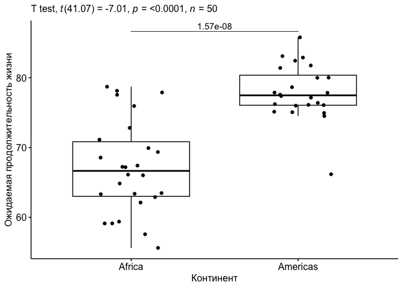
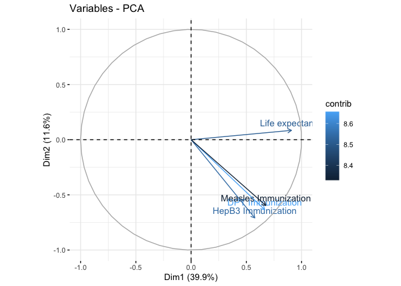

## Данные


```r
life_ex <- readRDS('life_expectancy_data.RDS')
str(life_ex)
```

```
## Classes 'data.table' and 'data.frame':	195 obs. of  23 variables:
##  $ Country                                : chr  "Afghanistan" "Albania" "Algeria" "Angola" ...
##  $ Year                                   : int  2019 2019 2019 2019 2019 2019 2019 2019 2019 2019 ...
##  $ Gender                                 : chr  "Female" "Female" "Female" "Female" ...
##  $ Life expectancy                        : num  66.4 80.2 78.1 64 78.1 ...
##  $ Unemployment                           : num  14.06 11.32 18.63 7.84 8.26 ...
##  $ Infant Mortality                       : num  42.9 7.7 18.6 44.5 5.1 ...
##  $ GDP                                    : num  1.88e+10 1.54e+10 1.72e+11 8.94e+10 1.69e+09 ...
##  $ GNI                                    : num  1.91e+10 1.52e+10 1.68e+11 8.19e+10 1.58e+09 ...
##  $ Clean fuels and cooking technologies   : num  36 80.7 99.3 49.6 100 ...
##  $ Per Capita                             : num  494 5396 3990 2810 17377 ...
##  $ Mortality caused by road traffic injury: num  15.9 11.7 20.9 26.1 0 ...
##  $ Tuberculosis Incidence                 : num  189 16 61 351 0 29 26 2.2 6.9 6 ...
##  $ DPT Immunization                       : num  66 99 91 57 95 ...
##  $ HepB3 Immunization                     : num  66 99 91 53 99 ...
##  $ Measles Immunization                   : num  64 95 80 51 93 ...
##  $ Hospital beds                          : num  0.432 3.052 1.8 0.8 2.581 ...
##  $ Basic sanitation services              : num  49 99.2 86.1 51.4 85.5 ...
##  $ Tuberculosis treatment                 : num  91 88 86 69 72.3 ...
##  $ Urban population                       : num  25.8 61.2 73.2 66.2 24.5 ...
##  $ Rural population                       : num  74.2 38.8 26.8 33.8 75.5 ...
##  $ Non-communicable Mortality             : num  36.2 6 12.8 19.4 17.6 ...
##  $ Sucide Rate                            : num  3.6 2.7 1.8 2.3 0.8 ...
##  $ continent                              : Factor w/ 5 levels "Africa","Americas",..: 3 4 1 1 2 2 4 2 5 4 ...
##  - attr(*, ".internal.selfref")=<externalptr> 
##  - attr(*, "sorted")= chr "Country"
```

## Plotly график количества городского населения по странам


```r
urb_viz <- 
  life_ex %>% 
  ggplot(aes(x = Country, y = `Urban population`, fill  = continent)) +
  facet_wrap(~continent)+
  geom_col() +
  theme(axis.text.x =element_blank())
ggplotly(urb_viz)
```

```{=html}
<div class="plotly html-widget html-fill-item-overflow-hidden html-fill-item" id="htmlwidget-57ea57780edd56f4b9e1" style="width:672px;height:480px;"></div>
<script type="application/json" data-for="htmlwidget-57ea57780edd56f4b9e1">{"x":{"data":[{"orientation":"v","width":[0.90000000000000036,0.90000000000000036,0.89999999999999858,0.89999999999999858,0.89999999999999858,0.89999999999999858,0.89999999999999858,0.90000000000000213,0.90000000000000568,0.90000000000000568,0.90000000000000568,0.90000000000000568,0.90000000000000568,0.90000000000000568,0.90000000000000568,0.90000000000000568,0.90000000000000568,0.90000000000000568,0.90000000000000568,0.90000000000000568,0.90000000000000568,0.90000000000000568,0.90000000000000568,0.90000000000000568,0.90000000000000568,0.90000000000000568,0.90000000000000568,0.90000000000000568,0.90000000000000568,0.90000000000000568,0.90000000000000568,0.90000000000000568,0.90000000000000568,0.90000000000000568,0.90000000000000568,0.90000000000000568,0.89999999999997726,0.89999999999997726,0.89999999999997726,0.89999999999997726,0.89999999999997726,0.89999999999997726,0.89999999999997726,0.89999999999997726,0.89999999999997726,0.89999999999997726,0.89999999999997726,0.89999999999997726,0.89999999999997726,0.89999999999997726,0.89999999999997726,0.89999999999997726],"base":[0,0,0,0,0,0,0,0,0,0,0,0,0,0,0,0,0,0,0,0,0,0,0,0,0,0,0,0,0,0,0,0,0,0,0,0,0,0,0,0,0,0,0,0,0,0,0,0,0,0,0,0],"x":[3,4,19,24,28,29,30,32,34,39,40,41,43,49,52,54,55,57,58,64,65,68,73,74,92,101,102,103,108,109,112,114,115,121,122,124,130,131,147,149,151,154,159,160,161,167,173,176,179,182,194,195],"y":[73.188999999999993,66.177000000000007,47.860999999999997,70.171999999999997,29.98,13.366,66.194999999999993,56.968000000000004,23.279,29.164000000000001,45.045999999999999,67.373000000000005,51.238999999999997,77.915000000000006,42.729999999999997,72.626999999999995,31.457416666666671,23.981000000000002,21.225000000000001,89.741,61.930999999999997,56.707000000000001,36.5,43.777000000000001,27.507000000000001,28.585000000000001,51.615000000000002,80.393000000000001,37.860999999999997,17.173999999999999,43.136000000000003,54.506999999999998,40.765999999999998,62.994,36.527999999999999,51.042000000000002,16.516999999999999,51.156999999999996,17.312999999999999,73.597999999999999,47.652999999999999,42.484000000000002,45.554000000000002,66.855999999999995,19.899000000000001,34.936,34.5,42.247999999999998,69.254000000000005,24.361000000000001,44.072000000000003,32.210000000000001],"text":["Country: Algeria<br />Urban population:  73.18900<br />continent: Africa","Country: Angola<br />Urban population:  66.17700<br />continent: Africa","Country: Benin<br />Urban population:  47.86100<br />continent: Africa","Country: Botswana<br />Urban population:  70.17200<br />continent: Africa","Country: Burkina Faso<br />Urban population:  29.98000<br />continent: Africa","Country: Burundi<br />Urban population:  13.36600<br />continent: Africa","Country: Cabo Verde<br />Urban population:  66.19500<br />continent: Africa","Country: Cameroon<br />Urban population:  56.96800<br />continent: Africa","Country: Chad<br />Urban population:  23.27900<br />continent: Africa","Country: Comoros<br />Urban population:  29.16400<br />continent: Africa","Country: Congo, Dem. Rep.<br />Urban population:  45.04600<br />continent: Africa","Country: Congo, Rep.<br />Urban population:  67.37300<br />continent: Africa","Country: Cote d'Ivoire<br />Urban population:  51.23900<br />continent: Africa","Country: Djibouti<br />Urban population:  77.91500<br />continent: Africa","Country: Egypt, Arab Rep.<br />Urban population:  42.73000<br />continent: Africa","Country: Equatorial Guinea<br />Urban population:  72.62700<br />continent: Africa","Country: Eritrea<br />Urban population:  31.45742<br />continent: Africa","Country: Eswatini<br />Urban population:  23.98100<br />continent: Africa","Country: Ethiopia<br />Urban population:  21.22500<br />continent: Africa","Country: Gabon<br />Urban population:  89.74100<br />continent: Africa","Country: Gambia, The<br />Urban population:  61.93100<br />continent: Africa","Country: Ghana<br />Urban population:  56.70700<br />continent: Africa","Country: Guinea<br />Urban population:  36.50000<br />continent: Africa","Country: Guinea-Bissau<br />Urban population:  43.77700<br />continent: Africa","Country: Kenya<br />Urban population:  27.50700<br />continent: Africa","Country: Lesotho<br />Urban population:  28.58500<br />continent: Africa","Country: Liberia<br />Urban population:  51.61500<br />continent: Africa","Country: Libya<br />Urban population:  80.39300<br />continent: Africa","Country: Madagascar<br />Urban population:  37.86100<br />continent: Africa","Country: Malawi<br />Urban population:  17.17400<br />continent: Africa","Country: Mali<br />Urban population:  43.13600<br />continent: Africa","Country: Mauritania<br />Urban population:  54.50700<br />continent: Africa","Country: Mauritius<br />Urban population:  40.76600<br />continent: Africa","Country: Morocco<br />Urban population:  62.99400<br />continent: Africa","Country: Mozambique<br />Urban population:  36.52800<br />continent: Africa","Country: Namibia<br />Urban population:  51.04200<br />continent: Africa","Country: Niger<br />Urban population:  16.51700<br />continent: Africa","Country: Nigeria<br />Urban population:  51.15700<br />continent: Africa","Country: Rwanda<br />Urban population:  17.31300<br />continent: Africa","Country: Sao Tome and Principe<br />Urban population:  73.59800<br />continent: Africa","Country: Senegal<br />Urban population:  47.65300<br />continent: Africa","Country: Sierra Leone<br />Urban population:  42.48400<br />continent: Africa","Country: Somalia<br />Urban population:  45.55400<br />continent: Africa","Country: South Africa<br />Urban population:  66.85600<br />continent: Africa","Country: South Sudan<br />Urban population:  19.89900<br />continent: Africa","Country: Sudan<br />Urban population:  34.93600<br />continent: Africa","Country: Tanzania<br />Urban population:  34.50000<br />continent: Africa","Country: Togo<br />Urban population:  42.24800<br />continent: Africa","Country: Tunisia<br />Urban population:  69.25400<br />continent: Africa","Country: Uganda<br />Urban population:  24.36100<br />continent: Africa","Country: Zambia<br />Urban population:  44.07200<br />continent: Africa","Country: Zimbabwe<br />Urban population:  32.21000<br />continent: Africa"],"type":"bar","textposition":"none","marker":{"autocolorscale":false,"color":"rgba(248,118,109,1)","line":{"width":1.8897637795275593,"color":"transparent"}},"name":"Africa","legendgroup":"Africa","showlegend":true,"xaxis":"x","yaxis":"y","hoverinfo":"text","frame":null},{"orientation":"v","width":[0.90000000000000036,0.90000000000000036,0.89999999999999947,0.89999999999999858,0.89999999999999858,0.89999999999999858,0.89999999999999858,0.89999999999999858,0.89999999999999858,0.90000000000000568,0.90000000000000568,0.90000000000000568,0.90000000000000568,0.90000000000000568,0.90000000000000568,0.90000000000000568,0.90000000000000568,0.90000000000000568,0.90000000000000568,0.90000000000000568,0.90000000000000568,0.90000000000000568,0.90000000000000568,0.90000000000000568,0.89999999999997726,0.89999999999997726,0.89999999999997726,0.89999999999997726,0.89999999999997726,0.89999999999997726,0.89999999999997726,0.89999999999997726,0.89999999999997726,0.89999999999997726,0.89999999999997726,0.89999999999997726,0.89999999999997726,0.89999999999997726],"base":[0,0,0,0,0,0,0,0,0,0,0,0,0,0,0,0,0,0,0,0,0,0,0,0,0,0,0,0,0,0,0,0,0,0,0,0,0,0],"x":[5,6,8,12,15,18,20,22,25,33,36,38,42,45,50,51,53,70,72,75,76,77,88,116,129,136,138,139,143,164,165,166,168,178,186,187,190,192],"y":[24.506,91.991,43.545999999999999,83.132000000000005,31.158000000000001,45.866,100,69.772999999999996,86.823999999999998,81.481999999999999,87.643000000000001,81.103999999999999,80.075999999999993,77.108999999999995,81.828000000000003,63.985999999999997,72.745999999999995,36.396000000000001,51.439,26.689,56.192,57.729999999999997,55.984999999999999,80.444000000000003,58.759999999999998,68.058999999999997,61.878999999999998,78.099000000000004,93.575999999999993,18.754000000000001,55.558734149771709,52.613999999999997,66.094999999999999,53.186999999999998,82.459000000000003,95.426000000000002,88.239999999999995,95.831999999999994],"text":["Country: Antigua and Barbuda<br />Urban population:  24.50600<br />continent: Americas","Country: Argentina<br />Urban population:  91.99100<br />continent: Americas","Country: Aruba<br />Urban population:  43.54600<br />continent: Americas","Country: Bahamas, The<br />Urban population:  83.13200<br />continent: Americas","Country: Barbados<br />Urban population:  31.15800<br />continent: Americas","Country: Belize<br />Urban population:  45.86600<br />continent: Americas","Country: Bermuda<br />Urban population: 100.00000<br />continent: Americas","Country: Bolivia<br />Urban population:  69.77300<br />continent: Americas","Country: Brazil<br />Urban population:  86.82400<br />continent: Americas","Country: Canada<br />Urban population:  81.48200<br />continent: Americas","Country: Chile<br />Urban population:  87.64300<br />continent: Americas","Country: Colombia<br />Urban population:  81.10400<br />continent: Americas","Country: Costa Rica<br />Urban population:  80.07600<br />continent: Americas","Country: Cuba<br />Urban population:  77.10900<br />continent: Americas","Country: Dominican Republic<br />Urban population:  81.82800<br />continent: Americas","Country: Ecuador<br />Urban population:  63.98600<br />continent: Americas","Country: El Salvador<br />Urban population:  72.74600<br />continent: Americas","Country: Grenada<br />Urban population:  36.39600<br />continent: Americas","Country: Guatemala<br />Urban population:  51.43900<br />continent: Americas","Country: Guyana<br />Urban population:  26.68900<br />continent: Americas","Country: Haiti<br />Urban population:  56.19200<br />continent: Americas","Country: Honduras<br />Urban population:  57.73000<br />continent: Americas","Country: Jamaica<br />Urban population:  55.98500<br />continent: Americas","Country: Mexico<br />Urban population:  80.44400<br />continent: Americas","Country: Nicaragua<br />Urban population:  58.76000<br />continent: Americas","Country: Panama<br />Urban population:  68.05900<br />continent: Americas","Country: Paraguay<br />Urban population:  61.87900<br />continent: Americas","Country: Peru<br />Urban population:  78.09900<br />continent: Americas","Country: Puerto Rico<br />Urban population:  93.57600<br />continent: Americas","Country: St. Lucia<br />Urban population:  18.75400<br />continent: Americas","Country: St. Martin (French part)<br />Urban population:  55.55873<br />continent: Americas","Country: St. Vincent and the Grenadines<br />Urban population:  52.61400<br />continent: Americas","Country: Suriname<br />Urban population:  66.09500<br />continent: Americas","Country: Trinidad and Tobago<br />Urban population:  53.18700<br />continent: Americas","Country: United States<br />Urban population:  82.45900<br />continent: Americas","Country: Uruguay<br />Urban population:  95.42600<br />continent: Americas","Country: Venezuela, RB<br />Urban population:  88.24000<br />continent: Americas","Country: Virgin Islands (U.S.)<br />Urban population:  95.83200<br />continent: Americas"],"type":"bar","textposition":"none","marker":{"autocolorscale":false,"color":"rgba(163,165,0,1)","line":{"width":1.8897637795275593,"color":"transparent"}},"name":"Americas","legendgroup":"Americas","showlegend":true,"xaxis":"x2","yaxis":"y","hoverinfo":"text","frame":null},{"orientation":"v","width":[0.89999999999999991,0.89999999999999858,0.89999999999999858,0.89999999999999858,0.89999999999999858,0.90000000000000568,0.90000000000000568,0.90000000000000568,0.90000000000000568,0.90000000000000568,0.90000000000000568,0.90000000000000568,0.90000000000000568,0.90000000000000568,0.90000000000000568,0.90000000000000568,0.90000000000000568,0.90000000000000568,0.90000000000000568,0.90000000000000568,0.90000000000000568,0.90000000000000568,0.90000000000000568,0.90000000000000568,0.90000000000000568,0.90000000000000568,0.89999999999997726,0.89999999999997726,0.89999999999997726,0.89999999999997726,0.89999999999997726,0.89999999999997726,0.89999999999997726,0.89999999999997726,0.89999999999997726,0.89999999999997726,0.89999999999997726,0.89999999999997726,0.89999999999997726,0.89999999999997726,0.89999999999997726,0.89999999999997726],"base":[0,0,0,0,0,0,0,0,0,0,0,0,0,0,0,0,0,0,0,0,0,0,0,0,0,0,0,0,0,0,0,0,0,0,0,0,0,0,0,0,0,0],"x":[1,13,14,21,31,37,78,81,82,83,84,86,89,90,91,94,95,97,98,100,107,110,111,119,123,125,134,135,140,144,150,153,155,163,171,172,174,181,184,188,191,193],"y":[25.754000000000001,89.394000000000005,37.405000000000001,41.612000000000002,23.805,60.308,100,34.472000000000001,55.984999999999999,75.391000000000005,70.677999999999997,92.501000000000005,91.697999999999993,91.203000000000003,57.539999999999999,62.134,81.430000000000007,100,36.591000000000001,88.757999999999996,100,76.606999999999999,40.238,68.543000000000006,30.852,20.152999999999999,85.442999999999998,36.906999999999996,47.149000000000001,99.188000000000002,84.064999999999998,57.119,100,18.585000000000001,54.820999999999998,27.309000000000001,50.692,52.048000000000002,86.789000000000001,50.433,36.628,37.273000000000003],"text":["Country: Afghanistan<br />Urban population:  25.75400<br />continent: Asia","Country: Bahrain<br />Urban population:  89.39400<br />continent: Asia","Country: Bangladesh<br />Urban population:  37.40500<br />continent: Asia","Country: Bhutan<br />Urban population:  41.61200<br />continent: Asia","Country: Cambodia<br />Urban population:  23.80500<br />continent: Asia","Country: China<br />Urban population:  60.30800<br />continent: Asia","Country: Hong Kong SAR, China<br />Urban population: 100.00000<br />continent: Asia","Country: India<br />Urban population:  34.47200<br />continent: Asia","Country: Indonesia<br />Urban population:  55.98500<br />continent: Asia","Country: Iran, Islamic Rep.<br />Urban population:  75.39100<br />continent: Asia","Country: Iraq<br />Urban population:  70.67800<br />continent: Asia","Country: Israel<br />Urban population:  92.50100<br />continent: Asia","Country: Japan<br />Urban population:  91.69800<br />continent: Asia","Country: Jordan<br />Urban population:  91.20300<br />continent: Asia","Country: Kazakhstan<br />Urban population:  57.54000<br />continent: Asia","Country: Korea, Dem. People's Rep.<br />Urban population:  62.13400<br />continent: Asia","Country: Korea, Rep.<br />Urban population:  81.43000<br />continent: Asia","Country: Kuwait<br />Urban population: 100.00000<br />continent: Asia","Country: Kyrgyz Republic<br />Urban population:  36.59100<br />continent: Asia","Country: Lebanon<br />Urban population:  88.75800<br />continent: Asia","Country: Macao SAR, China<br />Urban population: 100.00000<br />continent: Asia","Country: Malaysia<br />Urban population:  76.60700<br />continent: Asia","Country: Maldives<br />Urban population:  40.23800<br />continent: Asia","Country: Mongolia<br />Urban population:  68.54300<br />continent: Asia","Country: Myanmar<br />Urban population:  30.85200<br />continent: Asia","Country: Nepal<br />Urban population:  20.15300<br />continent: Asia","Country: Oman<br />Urban population:  85.44300<br />continent: Asia","Country: Pakistan<br />Urban population:  36.90700<br />continent: Asia","Country: Philippines<br />Urban population:  47.14900<br />continent: Asia","Country: Qatar<br />Urban population:  99.18800<br />continent: Asia","Country: Saudi Arabia<br />Urban population:  84.06500<br />continent: Asia","Country: Seychelles<br />Urban population:  57.11900<br />continent: Asia","Country: Singapore<br />Urban population: 100.00000<br />continent: Asia","Country: Sri Lanka<br />Urban population:  18.58500<br />continent: Asia","Country: Syrian Arab Republic<br />Urban population:  54.82100<br />continent: Asia","Country: Tajikistan<br />Urban population:  27.30900<br />continent: Asia","Country: Thailand<br />Urban population:  50.69200<br />continent: Asia","Country: Turkmenistan<br />Urban population:  52.04800<br />continent: Asia","Country: United Arab Emirates<br />Urban population:  86.78900<br />continent: Asia","Country: Uzbekistan<br />Urban population:  50.43300<br />continent: Asia","Country: Vietnam<br />Urban population:  36.62800<br />continent: Asia","Country: Yemen, Rep.<br />Urban population:  37.27300<br />continent: Asia"],"type":"bar","textposition":"none","marker":{"autocolorscale":false,"color":"rgba(0,191,125,1)","line":{"width":1.8897637795275593,"color":"transparent"}},"name":"Asia","legendgroup":"Asia","showlegend":true,"xaxis":"x3","yaxis":"y","hoverinfo":"text","frame":null},{"orientation":"v","width":[0.90000000000000013,0.90000000000000036,0.89999999999999858,0.89999999999999858,0.89999999999999858,0.89999999999999858,0.89999999999999858,0.89999999999999858,0.90000000000000568,0.90000000000000568,0.90000000000000568,0.90000000000000568,0.90000000000000568,0.90000000000000568,0.90000000000000568,0.90000000000000568,0.90000000000000568,0.90000000000000568,0.90000000000000568,0.90000000000000568,0.90000000000000568,0.90000000000000568,0.90000000000000568,0.90000000000000568,0.90000000000000568,0.90000000000000568,0.90000000000000568,0.90000000000000568,0.90000000000000568,0.90000000000000568,0.90000000000000568,0.90000000000000568,0.90000000000000568,0.89999999999997726,0.89999999999997726,0.89999999999997726,0.89999999999997726,0.89999999999997726,0.89999999999997726,0.89999999999997726,0.89999999999997726,0.89999999999997726,0.89999999999997726,0.89999999999997726,0.89999999999997726,0.89999999999997726,0.89999999999997726,0.89999999999997726],"base":[0,0,0,0,0,0,0,0,0,0,0,0,0,0,0,0,0,0,0,0,0,0,0,0,0,0,0,0,0,0,0,0,0,0,0,0,0,0,0,0,0,0,0,0,0,0,0,0],"x":[2,7,10,11,16,17,23,27,35,44,46,47,48,56,59,61,62,66,67,69,79,80,85,87,96,99,104,105,106,113,118,120,126,132,133,141,142,145,146,152,156,157,162,169,170,180,183,185],"y":[61.228999999999999,63.219000000000001,58.515000000000001,56.030999999999999,79.043999999999997,98.040999999999997,48.625999999999998,75.346999999999994,30.931000000000001,57.241999999999997,66.805000000000007,73.921000000000006,87.994,69.051000000000002,42.225000000000001,85.445999999999998,80.709000000000003,59.039000000000001,77.376000000000005,79.388000000000005,71.644000000000005,93.855000000000004,63.405000000000001,70.736000000000004,55.558734149771709,68.221999999999994,14.371,67.855000000000004,91.222999999999999,94.677999999999997,42.725999999999999,67.150000000000006,91.876000000000005,58.207999999999998,82.616,60.036999999999999,65.763999999999996,54.084000000000003,74.587000000000003,56.259999999999998,53.728999999999999,54.822000000000003,80.564999999999998,87.707999999999998,73.849000000000004,75.629999999999995,69.472999999999999,83.652000000000001],"text":["Country: Albania<br />Urban population:  61.22900<br />continent: Europe","Country: Armenia<br />Urban population:  63.21900<br />continent: Europe","Country: Austria<br />Urban population:  58.51500<br />continent: Europe","Country: Azerbaijan<br />Urban population:  56.03100<br />continent: Europe","Country: Belarus<br />Urban population:  79.04400<br />continent: Europe","Country: Belgium<br />Urban population:  98.04100<br />continent: Europe","Country: Bosnia and Herzegovina<br />Urban population:  48.62600<br />continent: Europe","Country: Bulgaria<br />Urban population:  75.34700<br />continent: Europe","Country: Channel Islands<br />Urban population:  30.93100<br />continent: Europe","Country: Croatia<br />Urban population:  57.24200<br />continent: Europe","Country: Cyprus<br />Urban population:  66.80500<br />continent: Europe","Country: Czech Republic<br />Urban population:  73.92100<br />continent: Europe","Country: Denmark<br />Urban population:  87.99400<br />continent: Europe","Country: Estonia<br />Urban population:  69.05100<br />continent: Europe","Country: Faroe Islands<br />Urban population:  42.22500<br />continent: Europe","Country: Finland<br />Urban population:  85.44600<br />continent: Europe","Country: France<br />Urban population:  80.70900<br />continent: Europe","Country: Georgia<br />Urban population:  59.03900<br />continent: Europe","Country: Germany<br />Urban population:  77.37600<br />continent: Europe","Country: Greece<br />Urban population:  79.38800<br />continent: Europe","Country: Hungary<br />Urban population:  71.64400<br />continent: Europe","Country: Iceland<br />Urban population:  93.85500<br />continent: Europe","Country: Ireland<br />Urban population:  63.40500<br />continent: Europe","Country: Italy<br />Urban population:  70.73600<br />continent: Europe","Country: Kosovo<br />Urban population:  55.55873<br />continent: Europe","Country: Latvia<br />Urban population:  68.22200<br />continent: Europe","Country: Liechtenstein<br />Urban population:  14.37100<br />continent: Europe","Country: Lithuania<br />Urban population:  67.85500<br />continent: Europe","Country: Luxembourg<br />Urban population:  91.22300<br />continent: Europe","Country: Malta<br />Urban population:  94.67800<br />continent: Europe","Country: Moldova<br />Urban population:  42.72600<br />continent: Europe","Country: Montenegro<br />Urban population:  67.15000<br />continent: Europe","Country: Netherlands<br />Urban population:  91.87600<br />continent: Europe","Country: North Macedonia<br />Urban population:  58.20800<br />continent: Europe","Country: Norway<br />Urban population:  82.61600<br />continent: Europe","Country: Poland<br />Urban population:  60.03700<br />continent: Europe","Country: Portugal<br />Urban population:  65.76400<br />continent: Europe","Country: Romania<br />Urban population:  54.08400<br />continent: Europe","Country: Russian Federation<br />Urban population:  74.58700<br />continent: Europe","Country: Serbia<br />Urban population:  56.26000<br />continent: Europe","Country: Slovak Republic<br />Urban population:  53.72900<br />continent: Europe","Country: Slovenia<br />Urban population:  54.82200<br />continent: Europe","Country: Spain<br />Urban population:  80.56500<br />continent: Europe","Country: Sweden<br />Urban population:  87.70800<br />continent: Europe","Country: Switzerland<br />Urban population:  73.84900<br />continent: Europe","Country: Turkey<br />Urban population:  75.63000<br />continent: Europe","Country: Ukraine<br />Urban population:  69.47300<br />continent: Europe","Country: United Kingdom<br />Urban population:  83.65200<br />continent: Europe"],"type":"bar","textposition":"none","marker":{"autocolorscale":false,"color":"rgba(0,176,246,1)","line":{"width":1.8897637795275593,"color":"transparent"}},"name":"Europe","legendgroup":"Europe","showlegend":true,"xaxis":"x","yaxis":"y2","hoverinfo":"text","frame":null},{"orientation":"v","width":[0.89999999999999858,0.89999999999999858,0.90000000000000568,0.90000000000000568,0.90000000000000568,0.90000000000000568,0.90000000000000568,0.90000000000000568,0.89999999999999147,0.89999999999997726,0.89999999999997726,0.89999999999997726,0.89999999999997726,0.89999999999997726,0.89999999999997726],"base":[0,0,0,0,0,0,0,0,0,0,0,0,0,0,0],"x":[9,26,60,63,71,93,117,127,128,137,148,158,175,177,189],"y":[86.123999999999995,77.941999999999993,56.75,61.896999999999998,94.858999999999995,54.835000000000001,22.812000000000001,71.103999999999999,86.614999999999995,13.25,18.056000000000001,24.210000000000001,30.946999999999999,23.106999999999999,25.393999999999998],"text":["Country: Australia<br />Urban population:  86.12400<br />continent: Oceania","Country: Brunei Darussalam<br />Urban population:  77.94200<br />continent: Oceania","Country: Fiji<br />Urban population:  56.75000<br />continent: Oceania","Country: French Polynesia<br />Urban population:  61.89700<br />continent: Oceania","Country: Guam<br />Urban population:  94.85900<br />continent: Oceania","Country: Kiribati<br />Urban population:  54.83500<br />continent: Oceania","Country: Micronesia, Fed. Sts.<br />Urban population:  22.81200<br />continent: Oceania","Country: New Caledonia<br />Urban population:  71.10400<br />continent: Oceania","Country: New Zealand<br />Urban population:  86.61500<br />continent: Oceania","Country: Papua New Guinea<br />Urban population:  13.25000<br />continent: Oceania","Country: Samoa<br />Urban population:  18.05600<br />continent: Oceania","Country: Solomon Islands<br />Urban population:  24.21000<br />continent: Oceania","Country: Timor-Leste<br />Urban population:  30.94700<br />continent: Oceania","Country: Tonga<br />Urban population:  23.10700<br />continent: Oceania","Country: Vanuatu<br />Urban population:  25.39400<br />continent: Oceania"],"type":"bar","textposition":"none","marker":{"autocolorscale":false,"color":"rgba(231,107,243,1)","line":{"width":1.8897637795275593,"color":"transparent"}},"name":"Oceania","legendgroup":"Oceania","showlegend":true,"xaxis":"x2","yaxis":"y2","hoverinfo":"text","frame":null}],"layout":{"margin":{"t":37.917808219178085,"r":7.3059360730593621,"b":28.493150684931514,"l":43.105022831050235},"plot_bgcolor":"rgba(235,235,235,1)","paper_bgcolor":"rgba(255,255,255,1)","font":{"color":"rgba(0,0,0,1)","family":"","size":14.611872146118724},"xaxis":{"domain":[0,0.32246140465318546],"automargin":true,"type":"linear","autorange":false,"range":[0.40000000000000002,195.59999999999999],"tickmode":"array","ticktext":["Afghanistan","Albania","Algeria","Angola","Antigua and Barbuda","Argentina","Armenia","Aruba","Australia","Austria","Azerbaijan","Bahamas, The","Bahrain","Bangladesh","Barbados","Belarus","Belgium","Belize","Benin","Bermuda","Bhutan","Bolivia","Bosnia and Herzegovina","Botswana","Brazil","Brunei Darussalam","Bulgaria","Burkina Faso","Burundi","Cabo Verde","Cambodia","Cameroon","Canada","Chad","Channel Islands","Chile","China","Colombia","Comoros","Congo, Dem. Rep.","Congo, Rep.","Costa Rica","Cote d'Ivoire","Croatia","Cuba","Cyprus","Czech Republic","Denmark","Djibouti","Dominican Republic","Ecuador","Egypt, Arab Rep.","El Salvador","Equatorial Guinea","Eritrea","Estonia","Eswatini","Ethiopia","Faroe Islands","Fiji","Finland","France","French Polynesia","Gabon","Gambia, The","Georgia","Germany","Ghana","Greece","Grenada","Guam","Guatemala","Guinea","Guinea-Bissau","Guyana","Haiti","Honduras","Hong Kong SAR, China","Hungary","Iceland","India","Indonesia","Iran, Islamic Rep.","Iraq","Ireland","Israel","Italy","Jamaica","Japan","Jordan","Kazakhstan","Kenya","Kiribati","Korea, Dem. People's Rep.","Korea, Rep.","Kosovo","Kuwait","Kyrgyz Republic","Latvia","Lebanon","Lesotho","Liberia","Libya","Liechtenstein","Lithuania","Luxembourg","Macao SAR, China","Madagascar","Malawi","Malaysia","Maldives","Mali","Malta","Mauritania","Mauritius","Mexico","Micronesia, Fed. Sts.","Moldova","Mongolia","Montenegro","Morocco","Mozambique","Myanmar","Namibia","Nepal","Netherlands","New Caledonia","New Zealand","Nicaragua","Niger","Nigeria","North Macedonia","Norway","Oman","Pakistan","Panama","Papua New Guinea","Paraguay","Peru","Philippines","Poland","Portugal","Puerto Rico","Qatar","Romania","Russian Federation","Rwanda","Samoa","Sao Tome and Principe","Saudi Arabia","Senegal","Serbia","Seychelles","Sierra Leone","Singapore","Slovak Republic","Slovenia","Solomon Islands","Somalia","South Africa","South Sudan","Spain","Sri Lanka","St. Lucia","St. Martin (French part)","St. Vincent and the Grenadines","Sudan","Suriname","Sweden","Switzerland","Syrian Arab Republic","Tajikistan","Tanzania","Thailand","Timor-Leste","Togo","Tonga","Trinidad and Tobago","Tunisia","Turkey","Turkmenistan","Uganda","Ukraine","United Arab Emirates","United Kingdom","United States","Uruguay","Uzbekistan","Vanuatu","Venezuela, RB","Vietnam","Virgin Islands (U.S.)","Yemen, Rep.","Zambia","Zimbabwe"],"tickvals":[1,2,3,4.0000000000000009,5,6,7.0000000000000009,8,9,10,11,12,13,14.000000000000002,15,16,17,18,19,20,21,22,23,24,25,26,27.000000000000004,28,29,30.000000000000004,31,32,33,34,35,36,37,38,39,40,41,42,43,44,45,46,47,48,49,50,50.999999999999993,52.000000000000007,53,54,55,56,56.999999999999993,58.000000000000007,59,60,61,62,63,63.999999999999993,65,66,67,68,69,70,71,72,73,74,75,76,77,78,79,80,81,82,83,84,85,86,87,88,89,90,91,92,93,94,95,96,97,98,99.000000000000014,100,101,102,103,103.99999999999999,105,106.00000000000001,107,108,108.99999999999999,110,110.99999999999999,112,113.00000000000001,114,115,115.99999999999999,117,118.00000000000001,119,120,121,122,122.99999999999999,124,125.00000000000001,126,127,128,129,130,131,132,133,134,135,136,137,138,139,140,141,142,143,144,145,146,147,148,149,150,151,152,153,154,155,156,157,158,159,160,161,162,163,164,165,166,167,168,169,170,171,172,173,174,175,176,177,178,179,180,181,182,183,184,185,186,187,188,189,190,191,192,193,194,195],"categoryorder":"array","categoryarray":["Afghanistan","Albania","Algeria","Angola","Antigua and Barbuda","Argentina","Armenia","Aruba","Australia","Austria","Azerbaijan","Bahamas, The","Bahrain","Bangladesh","Barbados","Belarus","Belgium","Belize","Benin","Bermuda","Bhutan","Bolivia","Bosnia and Herzegovina","Botswana","Brazil","Brunei Darussalam","Bulgaria","Burkina Faso","Burundi","Cabo Verde","Cambodia","Cameroon","Canada","Chad","Channel Islands","Chile","China","Colombia","Comoros","Congo, Dem. Rep.","Congo, Rep.","Costa Rica","Cote d'Ivoire","Croatia","Cuba","Cyprus","Czech Republic","Denmark","Djibouti","Dominican Republic","Ecuador","Egypt, Arab Rep.","El Salvador","Equatorial Guinea","Eritrea","Estonia","Eswatini","Ethiopia","Faroe Islands","Fiji","Finland","France","French Polynesia","Gabon","Gambia, The","Georgia","Germany","Ghana","Greece","Grenada","Guam","Guatemala","Guinea","Guinea-Bissau","Guyana","Haiti","Honduras","Hong Kong SAR, China","Hungary","Iceland","India","Indonesia","Iran, Islamic Rep.","Iraq","Ireland","Israel","Italy","Jamaica","Japan","Jordan","Kazakhstan","Kenya","Kiribati","Korea, Dem. People's Rep.","Korea, Rep.","Kosovo","Kuwait","Kyrgyz Republic","Latvia","Lebanon","Lesotho","Liberia","Libya","Liechtenstein","Lithuania","Luxembourg","Macao SAR, China","Madagascar","Malawi","Malaysia","Maldives","Mali","Malta","Mauritania","Mauritius","Mexico","Micronesia, Fed. Sts.","Moldova","Mongolia","Montenegro","Morocco","Mozambique","Myanmar","Namibia","Nepal","Netherlands","New Caledonia","New Zealand","Nicaragua","Niger","Nigeria","North Macedonia","Norway","Oman","Pakistan","Panama","Papua New Guinea","Paraguay","Peru","Philippines","Poland","Portugal","Puerto Rico","Qatar","Romania","Russian Federation","Rwanda","Samoa","Sao Tome and Principe","Saudi Arabia","Senegal","Serbia","Seychelles","Sierra Leone","Singapore","Slovak Republic","Slovenia","Solomon Islands","Somalia","South Africa","South Sudan","Spain","Sri Lanka","St. Lucia","St. Martin (French part)","St. Vincent and the Grenadines","Sudan","Suriname","Sweden","Switzerland","Syrian Arab Republic","Tajikistan","Tanzania","Thailand","Timor-Leste","Togo","Tonga","Trinidad and Tobago","Tunisia","Turkey","Turkmenistan","Uganda","Ukraine","United Arab Emirates","United Kingdom","United States","Uruguay","Uzbekistan","Vanuatu","Venezuela, RB","Vietnam","Virgin Islands (U.S.)","Yemen, Rep.","Zambia","Zimbabwe"],"nticks":null,"ticks":"outside","tickcolor":"rgba(51,51,51,1)","ticklen":3.6529680365296811,"tickwidth":0.66417600664176002,"showticklabels":false,"tickfont":{"color":null,"family":null,"size":0},"tickangle":-0,"showline":false,"linecolor":null,"linewidth":0,"showgrid":true,"gridcolor":"rgba(255,255,255,1)","gridwidth":0.66417600664176002,"zeroline":false,"anchor":"y2","title":"","hoverformat":".2f"},"annotations":[{"text":"Country","x":0.5,"y":0,"showarrow":false,"ax":0,"ay":0,"font":{"color":"rgba(0,0,0,1)","family":"","size":14.611872146118724},"xref":"paper","yref":"paper","textangle":-0,"xanchor":"center","yanchor":"top","annotationType":"axis","yshift":-7.3059360730593621},{"text":"Urban population","x":0,"y":0.5,"showarrow":false,"ax":0,"ay":0,"font":{"color":"rgba(0,0,0,1)","family":"","size":14.611872146118724},"xref":"paper","yref":"paper","textangle":-90,"xanchor":"right","yanchor":"center","annotationType":"axis","xshift":-27.762557077625573},{"text":"Africa","x":0.16123070232659273,"y":1,"showarrow":false,"ax":0,"ay":0,"font":{"color":"rgba(26,26,26,1)","family":"","size":11.68949771689498},"xref":"paper","yref":"paper","textangle":-0,"xanchor":"center","yanchor":"bottom"},{"text":"Americas","x":0.5,"y":1,"showarrow":false,"ax":0,"ay":0,"font":{"color":"rgba(26,26,26,1)","family":"","size":11.68949771689498},"xref":"paper","yref":"paper","textangle":-0,"xanchor":"center","yanchor":"bottom"},{"text":"Asia","x":0.83876929767340724,"y":1,"showarrow":false,"ax":0,"ay":0,"font":{"color":"rgba(26,26,26,1)","family":"","size":11.68949771689498},"xref":"paper","yref":"paper","textangle":-0,"xanchor":"center","yanchor":"bottom"},{"text":"Europe","x":0.16123070232659273,"y":0.4604261796042618,"showarrow":false,"ax":0,"ay":0,"font":{"color":"rgba(26,26,26,1)","family":"","size":11.68949771689498},"xref":"paper","yref":"paper","textangle":-0,"xanchor":"center","yanchor":"bottom"},{"text":"Oceania","x":0.5,"y":0.4604261796042618,"showarrow":false,"ax":0,"ay":0,"font":{"color":"rgba(26,26,26,1)","family":"","size":11.68949771689498},"xref":"paper","yref":"paper","textangle":-0,"xanchor":"center","yanchor":"bottom"}],"yaxis":{"domain":[0.5395738203957382,1],"automargin":true,"type":"linear","autorange":false,"range":[-5,105],"tickmode":"array","ticktext":["0","25","50","75","100"],"tickvals":[0,24.999999999999996,50,75,100],"categoryorder":"array","categoryarray":["0","25","50","75","100"],"nticks":null,"ticks":"outside","tickcolor":"rgba(51,51,51,1)","ticklen":3.6529680365296811,"tickwidth":0.66417600664176002,"showticklabels":true,"tickfont":{"color":"rgba(77,77,77,1)","family":"","size":11.68949771689498},"tickangle":-0,"showline":false,"linecolor":null,"linewidth":0,"showgrid":true,"gridcolor":"rgba(255,255,255,1)","gridwidth":0.66417600664176002,"zeroline":false,"anchor":"x","title":"","hoverformat":".2f"},"shapes":[{"type":"rect","fillcolor":null,"line":{"color":null,"width":0,"linetype":[]},"yref":"paper","xref":"paper","x0":0,"x1":0.32246140465318546,"y0":0.5395738203957382,"y1":1},{"type":"rect","fillcolor":"rgba(217,217,217,1)","line":{"color":"transparent","width":0.66417600664176002,"linetype":"solid"},"yref":"paper","xref":"paper","x0":0,"x1":0.32246140465318546,"y0":0,"y1":23.37899543378996,"yanchor":1,"ysizemode":"pixel"},{"type":"rect","fillcolor":null,"line":{"color":null,"width":0,"linetype":[]},"yref":"paper","xref":"paper","x0":0.34420526201348117,"x1":0.65579473798651877,"y0":0.5395738203957382,"y1":1},{"type":"rect","fillcolor":"rgba(217,217,217,1)","line":{"color":"transparent","width":0.66417600664176002,"linetype":"solid"},"yref":"paper","xref":"paper","x0":0.34420526201348117,"x1":0.65579473798651877,"y0":0,"y1":23.37899543378996,"yanchor":1,"ysizemode":"pixel"},{"type":"rect","fillcolor":null,"line":{"color":null,"width":0,"linetype":[]},"yref":"paper","xref":"paper","x0":0.67753859534681449,"x1":1,"y0":0.5395738203957382,"y1":1},{"type":"rect","fillcolor":"rgba(217,217,217,1)","line":{"color":"transparent","width":0.66417600664176002,"linetype":"solid"},"yref":"paper","xref":"paper","x0":0.67753859534681449,"x1":1,"y0":0,"y1":23.37899543378996,"yanchor":1,"ysizemode":"pixel"},{"type":"rect","fillcolor":null,"line":{"color":null,"width":0,"linetype":[]},"yref":"paper","xref":"paper","x0":0,"x1":0.32246140465318546,"y0":0,"y1":0.4604261796042618},{"type":"rect","fillcolor":"rgba(217,217,217,1)","line":{"color":"transparent","width":0.66417600664176002,"linetype":"solid"},"yref":"paper","xref":"paper","x0":0,"x1":0.32246140465318546,"y0":0,"y1":23.37899543378996,"yanchor":0.4604261796042618,"ysizemode":"pixel"},{"type":"rect","fillcolor":null,"line":{"color":null,"width":0,"linetype":[]},"yref":"paper","xref":"paper","x0":0.34420526201348117,"x1":0.65579473798651877,"y0":0,"y1":0.4604261796042618},{"type":"rect","fillcolor":"rgba(217,217,217,1)","line":{"color":"transparent","width":0.66417600664176002,"linetype":"solid"},"yref":"paper","xref":"paper","x0":0.34420526201348117,"x1":0.65579473798651877,"y0":0,"y1":23.37899543378996,"yanchor":0.4604261796042618,"ysizemode":"pixel"}],"xaxis2":{"type":"linear","autorange":false,"range":[0.40000000000000002,195.59999999999999],"tickmode":"array","ticktext":["Afghanistan","Albania","Algeria","Angola","Antigua and Barbuda","Argentina","Armenia","Aruba","Australia","Austria","Azerbaijan","Bahamas, The","Bahrain","Bangladesh","Barbados","Belarus","Belgium","Belize","Benin","Bermuda","Bhutan","Bolivia","Bosnia and Herzegovina","Botswana","Brazil","Brunei Darussalam","Bulgaria","Burkina Faso","Burundi","Cabo Verde","Cambodia","Cameroon","Canada","Chad","Channel Islands","Chile","China","Colombia","Comoros","Congo, Dem. Rep.","Congo, Rep.","Costa Rica","Cote d'Ivoire","Croatia","Cuba","Cyprus","Czech Republic","Denmark","Djibouti","Dominican Republic","Ecuador","Egypt, Arab Rep.","El Salvador","Equatorial Guinea","Eritrea","Estonia","Eswatini","Ethiopia","Faroe Islands","Fiji","Finland","France","French Polynesia","Gabon","Gambia, The","Georgia","Germany","Ghana","Greece","Grenada","Guam","Guatemala","Guinea","Guinea-Bissau","Guyana","Haiti","Honduras","Hong Kong SAR, China","Hungary","Iceland","India","Indonesia","Iran, Islamic Rep.","Iraq","Ireland","Israel","Italy","Jamaica","Japan","Jordan","Kazakhstan","Kenya","Kiribati","Korea, Dem. People's Rep.","Korea, Rep.","Kosovo","Kuwait","Kyrgyz Republic","Latvia","Lebanon","Lesotho","Liberia","Libya","Liechtenstein","Lithuania","Luxembourg","Macao SAR, China","Madagascar","Malawi","Malaysia","Maldives","Mali","Malta","Mauritania","Mauritius","Mexico","Micronesia, Fed. Sts.","Moldova","Mongolia","Montenegro","Morocco","Mozambique","Myanmar","Namibia","Nepal","Netherlands","New Caledonia","New Zealand","Nicaragua","Niger","Nigeria","North Macedonia","Norway","Oman","Pakistan","Panama","Papua New Guinea","Paraguay","Peru","Philippines","Poland","Portugal","Puerto Rico","Qatar","Romania","Russian Federation","Rwanda","Samoa","Sao Tome and Principe","Saudi Arabia","Senegal","Serbia","Seychelles","Sierra Leone","Singapore","Slovak Republic","Slovenia","Solomon Islands","Somalia","South Africa","South Sudan","Spain","Sri Lanka","St. Lucia","St. Martin (French part)","St. Vincent and the Grenadines","Sudan","Suriname","Sweden","Switzerland","Syrian Arab Republic","Tajikistan","Tanzania","Thailand","Timor-Leste","Togo","Tonga","Trinidad and Tobago","Tunisia","Turkey","Turkmenistan","Uganda","Ukraine","United Arab Emirates","United Kingdom","United States","Uruguay","Uzbekistan","Vanuatu","Venezuela, RB","Vietnam","Virgin Islands (U.S.)","Yemen, Rep.","Zambia","Zimbabwe"],"tickvals":[1,2,3,4.0000000000000009,5,6,7.0000000000000009,8,9,10,11,12,13,14.000000000000002,15,16,17,18,19,20,21,22,23,24,25,26,27.000000000000004,28,29,30.000000000000004,31,32,33,34,35,36,37,38,39,40,41,42,43,44,45,46,47,48,49,50,50.999999999999993,52.000000000000007,53,54,55,56,56.999999999999993,58.000000000000007,59,60,61,62,63,63.999999999999993,65,66,67,68,69,70,71,72,73,74,75,76,77,78,79,80,81,82,83,84,85,86,87,88,89,90,91,92,93,94,95,96,97,98,99.000000000000014,100,101,102,103,103.99999999999999,105,106.00000000000001,107,108,108.99999999999999,110,110.99999999999999,112,113.00000000000001,114,115,115.99999999999999,117,118.00000000000001,119,120,121,122,122.99999999999999,124,125.00000000000001,126,127,128,129,130,131,132,133,134,135,136,137,138,139,140,141,142,143,144,145,146,147,148,149,150,151,152,153,154,155,156,157,158,159,160,161,162,163,164,165,166,167,168,169,170,171,172,173,174,175,176,177,178,179,180,181,182,183,184,185,186,187,188,189,190,191,192,193,194,195],"categoryorder":"array","categoryarray":["Afghanistan","Albania","Algeria","Angola","Antigua and Barbuda","Argentina","Armenia","Aruba","Australia","Austria","Azerbaijan","Bahamas, The","Bahrain","Bangladesh","Barbados","Belarus","Belgium","Belize","Benin","Bermuda","Bhutan","Bolivia","Bosnia and Herzegovina","Botswana","Brazil","Brunei Darussalam","Bulgaria","Burkina Faso","Burundi","Cabo Verde","Cambodia","Cameroon","Canada","Chad","Channel Islands","Chile","China","Colombia","Comoros","Congo, Dem. Rep.","Congo, Rep.","Costa Rica","Cote d'Ivoire","Croatia","Cuba","Cyprus","Czech Republic","Denmark","Djibouti","Dominican Republic","Ecuador","Egypt, Arab Rep.","El Salvador","Equatorial Guinea","Eritrea","Estonia","Eswatini","Ethiopia","Faroe Islands","Fiji","Finland","France","French Polynesia","Gabon","Gambia, The","Georgia","Germany","Ghana","Greece","Grenada","Guam","Guatemala","Guinea","Guinea-Bissau","Guyana","Haiti","Honduras","Hong Kong SAR, China","Hungary","Iceland","India","Indonesia","Iran, Islamic Rep.","Iraq","Ireland","Israel","Italy","Jamaica","Japan","Jordan","Kazakhstan","Kenya","Kiribati","Korea, Dem. People's Rep.","Korea, Rep.","Kosovo","Kuwait","Kyrgyz Republic","Latvia","Lebanon","Lesotho","Liberia","Libya","Liechtenstein","Lithuania","Luxembourg","Macao SAR, China","Madagascar","Malawi","Malaysia","Maldives","Mali","Malta","Mauritania","Mauritius","Mexico","Micronesia, Fed. Sts.","Moldova","Mongolia","Montenegro","Morocco","Mozambique","Myanmar","Namibia","Nepal","Netherlands","New Caledonia","New Zealand","Nicaragua","Niger","Nigeria","North Macedonia","Norway","Oman","Pakistan","Panama","Papua New Guinea","Paraguay","Peru","Philippines","Poland","Portugal","Puerto Rico","Qatar","Romania","Russian Federation","Rwanda","Samoa","Sao Tome and Principe","Saudi Arabia","Senegal","Serbia","Seychelles","Sierra Leone","Singapore","Slovak Republic","Slovenia","Solomon Islands","Somalia","South Africa","South Sudan","Spain","Sri Lanka","St. Lucia","St. Martin (French part)","St. Vincent and the Grenadines","Sudan","Suriname","Sweden","Switzerland","Syrian Arab Republic","Tajikistan","Tanzania","Thailand","Timor-Leste","Togo","Tonga","Trinidad and Tobago","Tunisia","Turkey","Turkmenistan","Uganda","Ukraine","United Arab Emirates","United Kingdom","United States","Uruguay","Uzbekistan","Vanuatu","Venezuela, RB","Vietnam","Virgin Islands (U.S.)","Yemen, Rep.","Zambia","Zimbabwe"],"nticks":null,"ticks":"outside","tickcolor":"rgba(51,51,51,1)","ticklen":3.6529680365296811,"tickwidth":0.66417600664176002,"showticklabels":false,"tickfont":{"color":null,"family":null,"size":0},"tickangle":-0,"showline":false,"linecolor":null,"linewidth":0,"showgrid":true,"domain":[0.34420526201348117,0.65579473798651877],"gridcolor":"rgba(255,255,255,1)","gridwidth":0.66417600664176002,"zeroline":false,"anchor":"y2","title":"","hoverformat":".2f"},"xaxis3":{"type":"linear","autorange":false,"range":[0.40000000000000002,195.59999999999999],"tickmode":"array","ticktext":["Afghanistan","Albania","Algeria","Angola","Antigua and Barbuda","Argentina","Armenia","Aruba","Australia","Austria","Azerbaijan","Bahamas, The","Bahrain","Bangladesh","Barbados","Belarus","Belgium","Belize","Benin","Bermuda","Bhutan","Bolivia","Bosnia and Herzegovina","Botswana","Brazil","Brunei Darussalam","Bulgaria","Burkina Faso","Burundi","Cabo Verde","Cambodia","Cameroon","Canada","Chad","Channel Islands","Chile","China","Colombia","Comoros","Congo, Dem. Rep.","Congo, Rep.","Costa Rica","Cote d'Ivoire","Croatia","Cuba","Cyprus","Czech Republic","Denmark","Djibouti","Dominican Republic","Ecuador","Egypt, Arab Rep.","El Salvador","Equatorial Guinea","Eritrea","Estonia","Eswatini","Ethiopia","Faroe Islands","Fiji","Finland","France","French Polynesia","Gabon","Gambia, The","Georgia","Germany","Ghana","Greece","Grenada","Guam","Guatemala","Guinea","Guinea-Bissau","Guyana","Haiti","Honduras","Hong Kong SAR, China","Hungary","Iceland","India","Indonesia","Iran, Islamic Rep.","Iraq","Ireland","Israel","Italy","Jamaica","Japan","Jordan","Kazakhstan","Kenya","Kiribati","Korea, Dem. People's Rep.","Korea, Rep.","Kosovo","Kuwait","Kyrgyz Republic","Latvia","Lebanon","Lesotho","Liberia","Libya","Liechtenstein","Lithuania","Luxembourg","Macao SAR, China","Madagascar","Malawi","Malaysia","Maldives","Mali","Malta","Mauritania","Mauritius","Mexico","Micronesia, Fed. Sts.","Moldova","Mongolia","Montenegro","Morocco","Mozambique","Myanmar","Namibia","Nepal","Netherlands","New Caledonia","New Zealand","Nicaragua","Niger","Nigeria","North Macedonia","Norway","Oman","Pakistan","Panama","Papua New Guinea","Paraguay","Peru","Philippines","Poland","Portugal","Puerto Rico","Qatar","Romania","Russian Federation","Rwanda","Samoa","Sao Tome and Principe","Saudi Arabia","Senegal","Serbia","Seychelles","Sierra Leone","Singapore","Slovak Republic","Slovenia","Solomon Islands","Somalia","South Africa","South Sudan","Spain","Sri Lanka","St. Lucia","St. Martin (French part)","St. Vincent and the Grenadines","Sudan","Suriname","Sweden","Switzerland","Syrian Arab Republic","Tajikistan","Tanzania","Thailand","Timor-Leste","Togo","Tonga","Trinidad and Tobago","Tunisia","Turkey","Turkmenistan","Uganda","Ukraine","United Arab Emirates","United Kingdom","United States","Uruguay","Uzbekistan","Vanuatu","Venezuela, RB","Vietnam","Virgin Islands (U.S.)","Yemen, Rep.","Zambia","Zimbabwe"],"tickvals":[1,2,3,4.0000000000000009,5,6,7.0000000000000009,8,9,10,11,12,13,14.000000000000002,15,16,17,18,19,20,21,22,23,24,25,26,27.000000000000004,28,29,30.000000000000004,31,32,33,34,35,36,37,38,39,40,41,42,43,44,45,46,47,48,49,50,50.999999999999993,52.000000000000007,53,54,55,56,56.999999999999993,58.000000000000007,59,60,61,62,63,63.999999999999993,65,66,67,68,69,70,71,72,73,74,75,76,77,78,79,80,81,82,83,84,85,86,87,88,89,90,91,92,93,94,95,96,97,98,99.000000000000014,100,101,102,103,103.99999999999999,105,106.00000000000001,107,108,108.99999999999999,110,110.99999999999999,112,113.00000000000001,114,115,115.99999999999999,117,118.00000000000001,119,120,121,122,122.99999999999999,124,125.00000000000001,126,127,128,129,130,131,132,133,134,135,136,137,138,139,140,141,142,143,144,145,146,147,148,149,150,151,152,153,154,155,156,157,158,159,160,161,162,163,164,165,166,167,168,169,170,171,172,173,174,175,176,177,178,179,180,181,182,183,184,185,186,187,188,189,190,191,192,193,194,195],"categoryorder":"array","categoryarray":["Afghanistan","Albania","Algeria","Angola","Antigua and Barbuda","Argentina","Armenia","Aruba","Australia","Austria","Azerbaijan","Bahamas, The","Bahrain","Bangladesh","Barbados","Belarus","Belgium","Belize","Benin","Bermuda","Bhutan","Bolivia","Bosnia and Herzegovina","Botswana","Brazil","Brunei Darussalam","Bulgaria","Burkina Faso","Burundi","Cabo Verde","Cambodia","Cameroon","Canada","Chad","Channel Islands","Chile","China","Colombia","Comoros","Congo, Dem. Rep.","Congo, Rep.","Costa Rica","Cote d'Ivoire","Croatia","Cuba","Cyprus","Czech Republic","Denmark","Djibouti","Dominican Republic","Ecuador","Egypt, Arab Rep.","El Salvador","Equatorial Guinea","Eritrea","Estonia","Eswatini","Ethiopia","Faroe Islands","Fiji","Finland","France","French Polynesia","Gabon","Gambia, The","Georgia","Germany","Ghana","Greece","Grenada","Guam","Guatemala","Guinea","Guinea-Bissau","Guyana","Haiti","Honduras","Hong Kong SAR, China","Hungary","Iceland","India","Indonesia","Iran, Islamic Rep.","Iraq","Ireland","Israel","Italy","Jamaica","Japan","Jordan","Kazakhstan","Kenya","Kiribati","Korea, Dem. People's Rep.","Korea, Rep.","Kosovo","Kuwait","Kyrgyz Republic","Latvia","Lebanon","Lesotho","Liberia","Libya","Liechtenstein","Lithuania","Luxembourg","Macao SAR, China","Madagascar","Malawi","Malaysia","Maldives","Mali","Malta","Mauritania","Mauritius","Mexico","Micronesia, Fed. Sts.","Moldova","Mongolia","Montenegro","Morocco","Mozambique","Myanmar","Namibia","Nepal","Netherlands","New Caledonia","New Zealand","Nicaragua","Niger","Nigeria","North Macedonia","Norway","Oman","Pakistan","Panama","Papua New Guinea","Paraguay","Peru","Philippines","Poland","Portugal","Puerto Rico","Qatar","Romania","Russian Federation","Rwanda","Samoa","Sao Tome and Principe","Saudi Arabia","Senegal","Serbia","Seychelles","Sierra Leone","Singapore","Slovak Republic","Slovenia","Solomon Islands","Somalia","South Africa","South Sudan","Spain","Sri Lanka","St. Lucia","St. Martin (French part)","St. Vincent and the Grenadines","Sudan","Suriname","Sweden","Switzerland","Syrian Arab Republic","Tajikistan","Tanzania","Thailand","Timor-Leste","Togo","Tonga","Trinidad and Tobago","Tunisia","Turkey","Turkmenistan","Uganda","Ukraine","United Arab Emirates","United Kingdom","United States","Uruguay","Uzbekistan","Vanuatu","Venezuela, RB","Vietnam","Virgin Islands (U.S.)","Yemen, Rep.","Zambia","Zimbabwe"],"nticks":null,"ticks":"outside","tickcolor":"rgba(51,51,51,1)","ticklen":3.6529680365296811,"tickwidth":0.66417600664176002,"showticklabels":false,"tickfont":{"color":null,"family":null,"size":0},"tickangle":-0,"showline":false,"linecolor":null,"linewidth":0,"showgrid":true,"domain":[0.67753859534681449,1],"gridcolor":"rgba(255,255,255,1)","gridwidth":0.66417600664176002,"zeroline":false,"anchor":"y","title":"","hoverformat":".2f"},"yaxis2":{"type":"linear","autorange":false,"range":[-5,105],"tickmode":"array","ticktext":["0","25","50","75","100"],"tickvals":[0,24.999999999999996,50,75,100],"categoryorder":"array","categoryarray":["0","25","50","75","100"],"nticks":null,"ticks":"outside","tickcolor":"rgba(51,51,51,1)","ticklen":3.6529680365296811,"tickwidth":0.66417600664176002,"showticklabels":true,"tickfont":{"color":"rgba(77,77,77,1)","family":"","size":11.68949771689498},"tickangle":-0,"showline":false,"linecolor":null,"linewidth":0,"showgrid":true,"domain":[0,0.4604261796042618],"gridcolor":"rgba(255,255,255,1)","gridwidth":0.66417600664176002,"zeroline":false,"anchor":"x","title":"","hoverformat":".2f"},"showlegend":true,"legend":{"bgcolor":"rgba(255,255,255,1)","bordercolor":"transparent","borderwidth":1.8897637795275593,"font":{"color":"rgba(0,0,0,1)","family":"","size":11.68949771689498},"title":{"text":"continent","font":{"color":"rgba(0,0,0,1)","family":"","size":14.611872146118724}}},"hovermode":"closest","barmode":"relative"},"config":{"doubleClick":"reset","modeBarButtonsToAdd":["hoverclosest","hovercompare"],"showSendToCloud":false},"source":"A","attrs":{"128173f167d5c":{"x":{},"y":{},"fill":{},"type":"bar"}},"cur_data":"128173f167d5c","visdat":{"128173f167d5c":["function (y) ","x"]},"highlight":{"on":"plotly_click","persistent":false,"dynamic":false,"selectize":false,"opacityDim":0.20000000000000001,"selected":{"opacity":1},"debounce":0},"shinyEvents":["plotly_hover","plotly_click","plotly_selected","plotly_relayout","plotly_brushed","plotly_brushing","plotly_clickannotation","plotly_doubleclick","plotly_deselect","plotly_afterplot","plotly_sunburstclick"],"base_url":"https://plot.ly"},"evals":[],"jsHooks":[]}</script>
```

## Plotly график количества деревенского населения по странам


```r
rur_viz <- 
  life_ex %>% 
  ggplot(aes(x = Country, y = `Rural population`, fill  = continent)) +
  facet_wrap(~continent)+
  geom_col() +
  theme(axis.text.x = element_blank())
ggplotly(rur_viz)
```

```{=html}
<div class="plotly html-widget html-fill-item-overflow-hidden html-fill-item" id="htmlwidget-4a55ff23d8d194454f7a" style="width:672px;height:480px;"></div>
<script type="application/json" data-for="htmlwidget-4a55ff23d8d194454f7a">{"x":{"data":[{"orientation":"v","width":[0.90000000000000036,0.90000000000000036,0.89999999999999858,0.89999999999999858,0.89999999999999858,0.89999999999999858,0.89999999999999858,0.90000000000000213,0.90000000000000568,0.90000000000000568,0.90000000000000568,0.90000000000000568,0.90000000000000568,0.90000000000000568,0.90000000000000568,0.90000000000000568,0.90000000000000568,0.90000000000000568,0.90000000000000568,0.90000000000000568,0.90000000000000568,0.90000000000000568,0.90000000000000568,0.90000000000000568,0.90000000000000568,0.90000000000000568,0.90000000000000568,0.90000000000000568,0.90000000000000568,0.90000000000000568,0.90000000000000568,0.90000000000000568,0.90000000000000568,0.90000000000000568,0.90000000000000568,0.90000000000000568,0.89999999999997726,0.89999999999997726,0.89999999999997726,0.89999999999997726,0.89999999999997726,0.89999999999997726,0.89999999999997726,0.89999999999997726,0.89999999999997726,0.89999999999997726,0.89999999999997726,0.89999999999997726,0.89999999999997726,0.89999999999997726,0.89999999999997726,0.89999999999997726],"base":[0,0,0,0,0,0,0,0,0,0,0,0,0,0,0,0,0,0,0,0,0,0,0,0,0,0,0,0,0,0,0,0,0,0,0,0,0,0,0,0,0,0,0,0,0,0,0,0,0,0,0,0],"x":[3,4,19,24,28,29,30,32,34,39,40,41,43,49,52,54,55,57,58,64,65,68,73,74,92,101,102,103,108,109,112,114,115,121,122,124,130,131,147,149,151,154,159,160,161,167,173,176,179,182,194,195],"y":[26.811,33.823,52.139000000000003,29.827999999999999,70.019999999999996,86.634,33.805,43.031999999999996,76.721000000000004,70.835999999999999,54.954000000000001,32.627000000000002,48.761000000000003,22.085000000000001,57.270000000000003,27.373000000000001,68.542583333333354,76.019000000000005,78.775000000000006,10.259,38.069000000000003,43.292999999999999,63.5,56.222999999999999,72.492999999999995,71.415000000000006,48.384999999999998,19.606999999999999,62.139000000000003,82.825999999999993,56.863999999999997,45.493000000000002,59.234000000000002,37.006,63.472000000000001,48.957999999999998,83.483000000000004,48.843000000000004,82.686999999999998,26.402000000000001,52.347000000000001,57.515999999999998,54.445999999999998,33.143999999999998,80.100999999999999,65.063999999999993,65.5,57.752000000000002,30.745999999999999,75.638999999999996,55.927999999999997,67.790000000000006],"text":["Country: Algeria<br />Rural population: 26.81100<br />continent: Africa","Country: Angola<br />Rural population: 33.82300<br />continent: Africa","Country: Benin<br />Rural population: 52.13900<br />continent: Africa","Country: Botswana<br />Rural population: 29.82800<br />continent: Africa","Country: Burkina Faso<br />Rural population: 70.02000<br />continent: Africa","Country: Burundi<br />Rural population: 86.63400<br />continent: Africa","Country: Cabo Verde<br />Rural population: 33.80500<br />continent: Africa","Country: Cameroon<br />Rural population: 43.03200<br />continent: Africa","Country: Chad<br />Rural population: 76.72100<br />continent: Africa","Country: Comoros<br />Rural population: 70.83600<br />continent: Africa","Country: Congo, Dem. Rep.<br />Rural population: 54.95400<br />continent: Africa","Country: Congo, Rep.<br />Rural population: 32.62700<br />continent: Africa","Country: Cote d'Ivoire<br />Rural population: 48.76100<br />continent: Africa","Country: Djibouti<br />Rural population: 22.08500<br />continent: Africa","Country: Egypt, Arab Rep.<br />Rural population: 57.27000<br />continent: Africa","Country: Equatorial Guinea<br />Rural population: 27.37300<br />continent: Africa","Country: Eritrea<br />Rural population: 68.54258<br />continent: Africa","Country: Eswatini<br />Rural population: 76.01900<br />continent: Africa","Country: Ethiopia<br />Rural population: 78.77500<br />continent: Africa","Country: Gabon<br />Rural population: 10.25900<br />continent: Africa","Country: Gambia, The<br />Rural population: 38.06900<br />continent: Africa","Country: Ghana<br />Rural population: 43.29300<br />continent: Africa","Country: Guinea<br />Rural population: 63.50000<br />continent: Africa","Country: Guinea-Bissau<br />Rural population: 56.22300<br />continent: Africa","Country: Kenya<br />Rural population: 72.49300<br />continent: Africa","Country: Lesotho<br />Rural population: 71.41500<br />continent: Africa","Country: Liberia<br />Rural population: 48.38500<br />continent: Africa","Country: Libya<br />Rural population: 19.60700<br />continent: Africa","Country: Madagascar<br />Rural population: 62.13900<br />continent: Africa","Country: Malawi<br />Rural population: 82.82600<br />continent: Africa","Country: Mali<br />Rural population: 56.86400<br />continent: Africa","Country: Mauritania<br />Rural population: 45.49300<br />continent: Africa","Country: Mauritius<br />Rural population: 59.23400<br />continent: Africa","Country: Morocco<br />Rural population: 37.00600<br />continent: Africa","Country: Mozambique<br />Rural population: 63.47200<br />continent: Africa","Country: Namibia<br />Rural population: 48.95800<br />continent: Africa","Country: Niger<br />Rural population: 83.48300<br />continent: Africa","Country: Nigeria<br />Rural population: 48.84300<br />continent: Africa","Country: Rwanda<br />Rural population: 82.68700<br />continent: Africa","Country: Sao Tome and Principe<br />Rural population: 26.40200<br />continent: Africa","Country: Senegal<br />Rural population: 52.34700<br />continent: Africa","Country: Sierra Leone<br />Rural population: 57.51600<br />continent: Africa","Country: Somalia<br />Rural population: 54.44600<br />continent: Africa","Country: South Africa<br />Rural population: 33.14400<br />continent: Africa","Country: South Sudan<br />Rural population: 80.10100<br />continent: Africa","Country: Sudan<br />Rural population: 65.06400<br />continent: Africa","Country: Tanzania<br />Rural population: 65.50000<br />continent: Africa","Country: Togo<br />Rural population: 57.75200<br />continent: Africa","Country: Tunisia<br />Rural population: 30.74600<br />continent: Africa","Country: Uganda<br />Rural population: 75.63900<br />continent: Africa","Country: Zambia<br />Rural population: 55.92800<br />continent: Africa","Country: Zimbabwe<br />Rural population: 67.79000<br />continent: Africa"],"type":"bar","textposition":"none","marker":{"autocolorscale":false,"color":"rgba(248,118,109,1)","line":{"width":1.8897637795275593,"color":"transparent"}},"name":"Africa","legendgroup":"Africa","showlegend":true,"xaxis":"x","yaxis":"y","hoverinfo":"text","frame":null},{"orientation":"v","width":[0.90000000000000036,0.90000000000000036,0.89999999999999947,0.89999999999999858,0.89999999999999858,0.89999999999999858,0.89999999999999858,0.89999999999999858,0.89999999999999858,0.90000000000000568,0.90000000000000568,0.90000000000000568,0.90000000000000568,0.90000000000000568,0.90000000000000568,0.90000000000000568,0.90000000000000568,0.90000000000000568,0.90000000000000568,0.90000000000000568,0.90000000000000568,0.90000000000000568,0.90000000000000568,0.90000000000000568,0.89999999999997726,0.89999999999997726,0.89999999999997726,0.89999999999997726,0.89999999999997726,0.89999999999997726,0.89999999999997726,0.89999999999997726,0.89999999999997726,0.89999999999997726,0.89999999999997726,0.89999999999997726,0.89999999999997726,0.89999999999997726],"base":[0,0,0,0,0,0,0,0,0,0,0,0,0,0,0,0,0,0,0,0,0,0,0,0,0,0,0,0,0,0,0,0,0,0,0,0,0,0],"x":[5,6,8,12,15,18,20,22,25,33,36,38,42,45,50,51,53,70,72,75,76,77,88,116,129,136,138,139,143,164,165,166,168,178,186,187,190,192],"y":[75.494,8.0090000000000003,56.454000000000001,16.867999999999999,68.841999999999999,54.134,0,30.227,13.176,18.518000000000001,12.356999999999999,18.896000000000001,19.923999999999999,22.890999999999998,18.172000000000001,36.014000000000003,27.254000000000001,63.603999999999999,48.561,73.311000000000007,43.808,42.270000000000003,44.015000000000001,19.556000000000001,41.240000000000002,31.940999999999999,38.121000000000002,21.901,6.4240000000000101,81.245999999999995,44.441265850228334,47.386000000000003,33.905000000000001,46.813000000000002,17.541,4.5739999999999998,11.76,4.1680000000000099],"text":["Country: Antigua and Barbuda<br />Rural population: 75.49400<br />continent: Americas","Country: Argentina<br />Rural population:  8.00900<br />continent: Americas","Country: Aruba<br />Rural population: 56.45400<br />continent: Americas","Country: Bahamas, The<br />Rural population: 16.86800<br />continent: Americas","Country: Barbados<br />Rural population: 68.84200<br />continent: Americas","Country: Belize<br />Rural population: 54.13400<br />continent: Americas","Country: Bermuda<br />Rural population:  0.00000<br />continent: Americas","Country: Bolivia<br />Rural population: 30.22700<br />continent: Americas","Country: Brazil<br />Rural population: 13.17600<br />continent: Americas","Country: Canada<br />Rural population: 18.51800<br />continent: Americas","Country: Chile<br />Rural population: 12.35700<br />continent: Americas","Country: Colombia<br />Rural population: 18.89600<br />continent: Americas","Country: Costa Rica<br />Rural population: 19.92400<br />continent: Americas","Country: Cuba<br />Rural population: 22.89100<br />continent: Americas","Country: Dominican Republic<br />Rural population: 18.17200<br />continent: Americas","Country: Ecuador<br />Rural population: 36.01400<br />continent: Americas","Country: El Salvador<br />Rural population: 27.25400<br />continent: Americas","Country: Grenada<br />Rural population: 63.60400<br />continent: Americas","Country: Guatemala<br />Rural population: 48.56100<br />continent: Americas","Country: Guyana<br />Rural population: 73.31100<br />continent: Americas","Country: Haiti<br />Rural population: 43.80800<br />continent: Americas","Country: Honduras<br />Rural population: 42.27000<br />continent: Americas","Country: Jamaica<br />Rural population: 44.01500<br />continent: Americas","Country: Mexico<br />Rural population: 19.55600<br />continent: Americas","Country: Nicaragua<br />Rural population: 41.24000<br />continent: Americas","Country: Panama<br />Rural population: 31.94100<br />continent: Americas","Country: Paraguay<br />Rural population: 38.12100<br />continent: Americas","Country: Peru<br />Rural population: 21.90100<br />continent: Americas","Country: Puerto Rico<br />Rural population:  6.42400<br />continent: Americas","Country: St. Lucia<br />Rural population: 81.24600<br />continent: Americas","Country: St. Martin (French part)<br />Rural population: 44.44127<br />continent: Americas","Country: St. Vincent and the Grenadines<br />Rural population: 47.38600<br />continent: Americas","Country: Suriname<br />Rural population: 33.90500<br />continent: Americas","Country: Trinidad and Tobago<br />Rural population: 46.81300<br />continent: Americas","Country: United States<br />Rural population: 17.54100<br />continent: Americas","Country: Uruguay<br />Rural population:  4.57400<br />continent: Americas","Country: Venezuela, RB<br />Rural population: 11.76000<br />continent: Americas","Country: Virgin Islands (U.S.)<br />Rural population:  4.16800<br />continent: Americas"],"type":"bar","textposition":"none","marker":{"autocolorscale":false,"color":"rgba(163,165,0,1)","line":{"width":1.8897637795275593,"color":"transparent"}},"name":"Americas","legendgroup":"Americas","showlegend":true,"xaxis":"x2","yaxis":"y","hoverinfo":"text","frame":null},{"orientation":"v","width":[0.89999999999999991,0.89999999999999858,0.89999999999999858,0.89999999999999858,0.89999999999999858,0.90000000000000568,0.90000000000000568,0.90000000000000568,0.90000000000000568,0.90000000000000568,0.90000000000000568,0.90000000000000568,0.90000000000000568,0.90000000000000568,0.90000000000000568,0.90000000000000568,0.90000000000000568,0.90000000000000568,0.90000000000000568,0.90000000000000568,0.90000000000000568,0.90000000000000568,0.90000000000000568,0.90000000000000568,0.90000000000000568,0.90000000000000568,0.89999999999997726,0.89999999999997726,0.89999999999997726,0.89999999999997726,0.89999999999997726,0.89999999999997726,0.89999999999997726,0.89999999999997726,0.89999999999997726,0.89999999999997726,0.89999999999997726,0.89999999999997726,0.89999999999997726,0.89999999999997726,0.89999999999997726,0.89999999999997726],"base":[0,0,0,0,0,0,0,0,0,0,0,0,0,0,0,0,0,0,0,0,0,0,0,0,0,0,0,0,0,0,0,0,0,0,0,0,0,0,0,0,0,0],"x":[1,13,14,21,31,37,78,81,82,83,84,86,89,90,91,94,95,97,98,100,107,110,111,119,123,125,134,135,140,144,150,153,155,163,171,172,174,181,184,188,191,193],"y":[74.245999999999995,10.606,62.594999999999999,58.387999999999998,76.194999999999993,39.692,0,65.528000000000006,44.015000000000001,24.609000000000002,29.321999999999999,7.4989999999999997,8.3020000000000103,8.7970000000000006,42.460000000000001,37.866,18.57,0,63.408999999999999,11.242000000000001,0,23.393000000000001,59.762,31.457000000000001,69.147999999999996,79.846999999999994,14.557,63.093000000000004,52.850999999999999,0.81199999999999795,15.935,42.881,0,81.415000000000006,45.179000000000002,72.691000000000003,49.308,47.951999999999998,13.211,49.567,63.372,62.726999999999997],"text":["Country: Afghanistan<br />Rural population: 74.24600<br />continent: Asia","Country: Bahrain<br />Rural population: 10.60600<br />continent: Asia","Country: Bangladesh<br />Rural population: 62.59500<br />continent: Asia","Country: Bhutan<br />Rural population: 58.38800<br />continent: Asia","Country: Cambodia<br />Rural population: 76.19500<br />continent: Asia","Country: China<br />Rural population: 39.69200<br />continent: Asia","Country: Hong Kong SAR, China<br />Rural population:  0.00000<br />continent: Asia","Country: India<br />Rural population: 65.52800<br />continent: Asia","Country: Indonesia<br />Rural population: 44.01500<br />continent: Asia","Country: Iran, Islamic Rep.<br />Rural population: 24.60900<br />continent: Asia","Country: Iraq<br />Rural population: 29.32200<br />continent: Asia","Country: Israel<br />Rural population:  7.49900<br />continent: Asia","Country: Japan<br />Rural population:  8.30200<br />continent: Asia","Country: Jordan<br />Rural population:  8.79700<br />continent: Asia","Country: Kazakhstan<br />Rural population: 42.46000<br />continent: Asia","Country: Korea, Dem. People's Rep.<br />Rural population: 37.86600<br />continent: Asia","Country: Korea, Rep.<br />Rural population: 18.57000<br />continent: Asia","Country: Kuwait<br />Rural population:  0.00000<br />continent: Asia","Country: Kyrgyz Republic<br />Rural population: 63.40900<br />continent: Asia","Country: Lebanon<br />Rural population: 11.24200<br />continent: Asia","Country: Macao SAR, China<br />Rural population:  0.00000<br />continent: Asia","Country: Malaysia<br />Rural population: 23.39300<br />continent: Asia","Country: Maldives<br />Rural population: 59.76200<br />continent: Asia","Country: Mongolia<br />Rural population: 31.45700<br />continent: Asia","Country: Myanmar<br />Rural population: 69.14800<br />continent: Asia","Country: Nepal<br />Rural population: 79.84700<br />continent: Asia","Country: Oman<br />Rural population: 14.55700<br />continent: Asia","Country: Pakistan<br />Rural population: 63.09300<br />continent: Asia","Country: Philippines<br />Rural population: 52.85100<br />continent: Asia","Country: Qatar<br />Rural population:  0.81200<br />continent: Asia","Country: Saudi Arabia<br />Rural population: 15.93500<br />continent: Asia","Country: Seychelles<br />Rural population: 42.88100<br />continent: Asia","Country: Singapore<br />Rural population:  0.00000<br />continent: Asia","Country: Sri Lanka<br />Rural population: 81.41500<br />continent: Asia","Country: Syrian Arab Republic<br />Rural population: 45.17900<br />continent: Asia","Country: Tajikistan<br />Rural population: 72.69100<br />continent: Asia","Country: Thailand<br />Rural population: 49.30800<br />continent: Asia","Country: Turkmenistan<br />Rural population: 47.95200<br />continent: Asia","Country: United Arab Emirates<br />Rural population: 13.21100<br />continent: Asia","Country: Uzbekistan<br />Rural population: 49.56700<br />continent: Asia","Country: Vietnam<br />Rural population: 63.37200<br />continent: Asia","Country: Yemen, Rep.<br />Rural population: 62.72700<br />continent: Asia"],"type":"bar","textposition":"none","marker":{"autocolorscale":false,"color":"rgba(0,191,125,1)","line":{"width":1.8897637795275593,"color":"transparent"}},"name":"Asia","legendgroup":"Asia","showlegend":true,"xaxis":"x3","yaxis":"y","hoverinfo":"text","frame":null},{"orientation":"v","width":[0.90000000000000013,0.90000000000000036,0.89999999999999858,0.89999999999999858,0.89999999999999858,0.89999999999999858,0.89999999999999858,0.89999999999999858,0.90000000000000568,0.90000000000000568,0.90000000000000568,0.90000000000000568,0.90000000000000568,0.90000000000000568,0.90000000000000568,0.90000000000000568,0.90000000000000568,0.90000000000000568,0.90000000000000568,0.90000000000000568,0.90000000000000568,0.90000000000000568,0.90000000000000568,0.90000000000000568,0.90000000000000568,0.90000000000000568,0.90000000000000568,0.90000000000000568,0.90000000000000568,0.90000000000000568,0.90000000000000568,0.90000000000000568,0.90000000000000568,0.89999999999997726,0.89999999999997726,0.89999999999997726,0.89999999999997726,0.89999999999997726,0.89999999999997726,0.89999999999997726,0.89999999999997726,0.89999999999997726,0.89999999999997726,0.89999999999997726,0.89999999999997726,0.89999999999997726,0.89999999999997726,0.89999999999997726],"base":[0,0,0,0,0,0,0,0,0,0,0,0,0,0,0,0,0,0,0,0,0,0,0,0,0,0,0,0,0,0,0,0,0,0,0,0,0,0,0,0,0,0,0,0,0,0,0,0],"x":[2,7,10,11,16,17,23,27,35,44,46,47,48,56,59,61,62,66,67,69,79,80,85,87,96,99,104,105,106,113,118,120,126,132,133,141,142,145,146,152,156,157,162,169,170,180,183,185],"y":[38.771000000000001,36.780999999999999,41.484999999999999,43.969000000000001,20.956,1.9590000000000001,51.374000000000002,24.652999999999999,69.069000000000003,42.758000000000003,33.195,26.079000000000001,12.006,30.949000000000002,57.774999999999999,14.554,19.291,40.960999999999999,22.623999999999999,20.611999999999998,28.356000000000002,6.1449999999999996,36.594999999999999,29.263999999999999,44.441265850228334,31.777999999999999,85.629000000000005,32.145000000000003,8.7769999999999992,5.3220000000000001,57.274000000000001,32.850000000000001,8.1240000000000006,41.792000000000002,17.384,39.963000000000001,34.235999999999997,45.915999999999997,25.413,43.740000000000002,46.271000000000001,45.177999999999997,19.434999999999999,12.292,26.151,24.370000000000001,30.527000000000001,16.347999999999999],"text":["Country: Albania<br />Rural population: 38.77100<br />continent: Europe","Country: Armenia<br />Rural population: 36.78100<br />continent: Europe","Country: Austria<br />Rural population: 41.48500<br />continent: Europe","Country: Azerbaijan<br />Rural population: 43.96900<br />continent: Europe","Country: Belarus<br />Rural population: 20.95600<br />continent: Europe","Country: Belgium<br />Rural population:  1.95900<br />continent: Europe","Country: Bosnia and Herzegovina<br />Rural population: 51.37400<br />continent: Europe","Country: Bulgaria<br />Rural population: 24.65300<br />continent: Europe","Country: Channel Islands<br />Rural population: 69.06900<br />continent: Europe","Country: Croatia<br />Rural population: 42.75800<br />continent: Europe","Country: Cyprus<br />Rural population: 33.19500<br />continent: Europe","Country: Czech Republic<br />Rural population: 26.07900<br />continent: Europe","Country: Denmark<br />Rural population: 12.00600<br />continent: Europe","Country: Estonia<br />Rural population: 30.94900<br />continent: Europe","Country: Faroe Islands<br />Rural population: 57.77500<br />continent: Europe","Country: Finland<br />Rural population: 14.55400<br />continent: Europe","Country: France<br />Rural population: 19.29100<br />continent: Europe","Country: Georgia<br />Rural population: 40.96100<br />continent: Europe","Country: Germany<br />Rural population: 22.62400<br />continent: Europe","Country: Greece<br />Rural population: 20.61200<br />continent: Europe","Country: Hungary<br />Rural population: 28.35600<br />continent: Europe","Country: Iceland<br />Rural population:  6.14500<br />continent: Europe","Country: Ireland<br />Rural population: 36.59500<br />continent: Europe","Country: Italy<br />Rural population: 29.26400<br />continent: Europe","Country: Kosovo<br />Rural population: 44.44127<br />continent: Europe","Country: Latvia<br />Rural population: 31.77800<br />continent: Europe","Country: Liechtenstein<br />Rural population: 85.62900<br />continent: Europe","Country: Lithuania<br />Rural population: 32.14500<br />continent: Europe","Country: Luxembourg<br />Rural population:  8.77700<br />continent: Europe","Country: Malta<br />Rural population:  5.32200<br />continent: Europe","Country: Moldova<br />Rural population: 57.27400<br />continent: Europe","Country: Montenegro<br />Rural population: 32.85000<br />continent: Europe","Country: Netherlands<br />Rural population:  8.12400<br />continent: Europe","Country: North Macedonia<br />Rural population: 41.79200<br />continent: Europe","Country: Norway<br />Rural population: 17.38400<br />continent: Europe","Country: Poland<br />Rural population: 39.96300<br />continent: Europe","Country: Portugal<br />Rural population: 34.23600<br />continent: Europe","Country: Romania<br />Rural population: 45.91600<br />continent: Europe","Country: Russian Federation<br />Rural population: 25.41300<br />continent: Europe","Country: Serbia<br />Rural population: 43.74000<br />continent: Europe","Country: Slovak Republic<br />Rural population: 46.27100<br />continent: Europe","Country: Slovenia<br />Rural population: 45.17800<br />continent: Europe","Country: Spain<br />Rural population: 19.43500<br />continent: Europe","Country: Sweden<br />Rural population: 12.29200<br />continent: Europe","Country: Switzerland<br />Rural population: 26.15100<br />continent: Europe","Country: Turkey<br />Rural population: 24.37000<br />continent: Europe","Country: Ukraine<br />Rural population: 30.52700<br />continent: Europe","Country: United Kingdom<br />Rural population: 16.34800<br />continent: Europe"],"type":"bar","textposition":"none","marker":{"autocolorscale":false,"color":"rgba(0,176,246,1)","line":{"width":1.8897637795275593,"color":"transparent"}},"name":"Europe","legendgroup":"Europe","showlegend":true,"xaxis":"x","yaxis":"y2","hoverinfo":"text","frame":null},{"orientation":"v","width":[0.89999999999999858,0.89999999999999858,0.90000000000000568,0.90000000000000568,0.90000000000000568,0.90000000000000568,0.90000000000000568,0.90000000000000568,0.89999999999999147,0.89999999999997726,0.89999999999997726,0.89999999999997726,0.89999999999997726,0.89999999999997726,0.89999999999997726],"base":[0,0,0,0,0,0,0,0,0,0,0,0,0,0,0],"x":[9,26,60,63,71,93,117,127,128,137,148,158,175,177,189],"y":[13.875999999999999,22.058,43.25,38.103000000000002,5.1410000000000098,45.164999999999999,77.188000000000002,28.896000000000001,13.385,86.75,81.944000000000003,75.790000000000006,69.052999999999997,76.893000000000001,74.605999999999995],"text":["Country: Australia<br />Rural population: 13.87600<br />continent: Oceania","Country: Brunei Darussalam<br />Rural population: 22.05800<br />continent: Oceania","Country: Fiji<br />Rural population: 43.25000<br />continent: Oceania","Country: French Polynesia<br />Rural population: 38.10300<br />continent: Oceania","Country: Guam<br />Rural population:  5.14100<br />continent: Oceania","Country: Kiribati<br />Rural population: 45.16500<br />continent: Oceania","Country: Micronesia, Fed. Sts.<br />Rural population: 77.18800<br />continent: Oceania","Country: New Caledonia<br />Rural population: 28.89600<br />continent: Oceania","Country: New Zealand<br />Rural population: 13.38500<br />continent: Oceania","Country: Papua New Guinea<br />Rural population: 86.75000<br />continent: Oceania","Country: Samoa<br />Rural population: 81.94400<br />continent: Oceania","Country: Solomon Islands<br />Rural population: 75.79000<br />continent: Oceania","Country: Timor-Leste<br />Rural population: 69.05300<br />continent: Oceania","Country: Tonga<br />Rural population: 76.89300<br />continent: Oceania","Country: Vanuatu<br />Rural population: 74.60600<br />continent: Oceania"],"type":"bar","textposition":"none","marker":{"autocolorscale":false,"color":"rgba(231,107,243,1)","line":{"width":1.8897637795275593,"color":"transparent"}},"name":"Oceania","legendgroup":"Oceania","showlegend":true,"xaxis":"x2","yaxis":"y2","hoverinfo":"text","frame":null}],"layout":{"margin":{"t":37.917808219178085,"r":7.3059360730593621,"b":28.493150684931514,"l":37.260273972602747},"plot_bgcolor":"rgba(235,235,235,1)","paper_bgcolor":"rgba(255,255,255,1)","font":{"color":"rgba(0,0,0,1)","family":"","size":14.611872146118724},"xaxis":{"domain":[0,0.32246140465318546],"automargin":true,"type":"linear","autorange":false,"range":[0.40000000000000002,195.59999999999999],"tickmode":"array","ticktext":["Afghanistan","Albania","Algeria","Angola","Antigua and Barbuda","Argentina","Armenia","Aruba","Australia","Austria","Azerbaijan","Bahamas, The","Bahrain","Bangladesh","Barbados","Belarus","Belgium","Belize","Benin","Bermuda","Bhutan","Bolivia","Bosnia and Herzegovina","Botswana","Brazil","Brunei Darussalam","Bulgaria","Burkina Faso","Burundi","Cabo Verde","Cambodia","Cameroon","Canada","Chad","Channel Islands","Chile","China","Colombia","Comoros","Congo, Dem. Rep.","Congo, Rep.","Costa Rica","Cote d'Ivoire","Croatia","Cuba","Cyprus","Czech Republic","Denmark","Djibouti","Dominican Republic","Ecuador","Egypt, Arab Rep.","El Salvador","Equatorial Guinea","Eritrea","Estonia","Eswatini","Ethiopia","Faroe Islands","Fiji","Finland","France","French Polynesia","Gabon","Gambia, The","Georgia","Germany","Ghana","Greece","Grenada","Guam","Guatemala","Guinea","Guinea-Bissau","Guyana","Haiti","Honduras","Hong Kong SAR, China","Hungary","Iceland","India","Indonesia","Iran, Islamic Rep.","Iraq","Ireland","Israel","Italy","Jamaica","Japan","Jordan","Kazakhstan","Kenya","Kiribati","Korea, Dem. People's Rep.","Korea, Rep.","Kosovo","Kuwait","Kyrgyz Republic","Latvia","Lebanon","Lesotho","Liberia","Libya","Liechtenstein","Lithuania","Luxembourg","Macao SAR, China","Madagascar","Malawi","Malaysia","Maldives","Mali","Malta","Mauritania","Mauritius","Mexico","Micronesia, Fed. Sts.","Moldova","Mongolia","Montenegro","Morocco","Mozambique","Myanmar","Namibia","Nepal","Netherlands","New Caledonia","New Zealand","Nicaragua","Niger","Nigeria","North Macedonia","Norway","Oman","Pakistan","Panama","Papua New Guinea","Paraguay","Peru","Philippines","Poland","Portugal","Puerto Rico","Qatar","Romania","Russian Federation","Rwanda","Samoa","Sao Tome and Principe","Saudi Arabia","Senegal","Serbia","Seychelles","Sierra Leone","Singapore","Slovak Republic","Slovenia","Solomon Islands","Somalia","South Africa","South Sudan","Spain","Sri Lanka","St. Lucia","St. Martin (French part)","St. Vincent and the Grenadines","Sudan","Suriname","Sweden","Switzerland","Syrian Arab Republic","Tajikistan","Tanzania","Thailand","Timor-Leste","Togo","Tonga","Trinidad and Tobago","Tunisia","Turkey","Turkmenistan","Uganda","Ukraine","United Arab Emirates","United Kingdom","United States","Uruguay","Uzbekistan","Vanuatu","Venezuela, RB","Vietnam","Virgin Islands (U.S.)","Yemen, Rep.","Zambia","Zimbabwe"],"tickvals":[1,2,3,4.0000000000000009,5,6,7.0000000000000009,8,9,10,11,12,13,14.000000000000002,15,16,17,18,19,20,21,22,23,24,25,26,27.000000000000004,28,29,30.000000000000004,31,32,33,34,35,36,37,38,39,40,41,42,43,44,45,46,47,48,49,50,50.999999999999993,52.000000000000007,53,54,55,56,56.999999999999993,58.000000000000007,59,60,61,62,63,63.999999999999993,65,66,67,68,69,70,71,72,73,74,75,76,77,78,79,80,81,82,83,84,85,86,87,88,89,90,91,92,93,94,95,96,97,98,99.000000000000014,100,101,102,103,103.99999999999999,105,106.00000000000001,107,108,108.99999999999999,110,110.99999999999999,112,113.00000000000001,114,115,115.99999999999999,117,118.00000000000001,119,120,121,122,122.99999999999999,124,125.00000000000001,126,127,128,129,130,131,132,133,134,135,136,137,138,139,140,141,142,143,144,145,146,147,148,149,150,151,152,153,154,155,156,157,158,159,160,161,162,163,164,165,166,167,168,169,170,171,172,173,174,175,176,177,178,179,180,181,182,183,184,185,186,187,188,189,190,191,192,193,194,195],"categoryorder":"array","categoryarray":["Afghanistan","Albania","Algeria","Angola","Antigua and Barbuda","Argentina","Armenia","Aruba","Australia","Austria","Azerbaijan","Bahamas, The","Bahrain","Bangladesh","Barbados","Belarus","Belgium","Belize","Benin","Bermuda","Bhutan","Bolivia","Bosnia and Herzegovina","Botswana","Brazil","Brunei Darussalam","Bulgaria","Burkina Faso","Burundi","Cabo Verde","Cambodia","Cameroon","Canada","Chad","Channel Islands","Chile","China","Colombia","Comoros","Congo, Dem. Rep.","Congo, Rep.","Costa Rica","Cote d'Ivoire","Croatia","Cuba","Cyprus","Czech Republic","Denmark","Djibouti","Dominican Republic","Ecuador","Egypt, Arab Rep.","El Salvador","Equatorial Guinea","Eritrea","Estonia","Eswatini","Ethiopia","Faroe Islands","Fiji","Finland","France","French Polynesia","Gabon","Gambia, The","Georgia","Germany","Ghana","Greece","Grenada","Guam","Guatemala","Guinea","Guinea-Bissau","Guyana","Haiti","Honduras","Hong Kong SAR, China","Hungary","Iceland","India","Indonesia","Iran, Islamic Rep.","Iraq","Ireland","Israel","Italy","Jamaica","Japan","Jordan","Kazakhstan","Kenya","Kiribati","Korea, Dem. People's Rep.","Korea, Rep.","Kosovo","Kuwait","Kyrgyz Republic","Latvia","Lebanon","Lesotho","Liberia","Libya","Liechtenstein","Lithuania","Luxembourg","Macao SAR, China","Madagascar","Malawi","Malaysia","Maldives","Mali","Malta","Mauritania","Mauritius","Mexico","Micronesia, Fed. Sts.","Moldova","Mongolia","Montenegro","Morocco","Mozambique","Myanmar","Namibia","Nepal","Netherlands","New Caledonia","New Zealand","Nicaragua","Niger","Nigeria","North Macedonia","Norway","Oman","Pakistan","Panama","Papua New Guinea","Paraguay","Peru","Philippines","Poland","Portugal","Puerto Rico","Qatar","Romania","Russian Federation","Rwanda","Samoa","Sao Tome and Principe","Saudi Arabia","Senegal","Serbia","Seychelles","Sierra Leone","Singapore","Slovak Republic","Slovenia","Solomon Islands","Somalia","South Africa","South Sudan","Spain","Sri Lanka","St. Lucia","St. Martin (French part)","St. Vincent and the Grenadines","Sudan","Suriname","Sweden","Switzerland","Syrian Arab Republic","Tajikistan","Tanzania","Thailand","Timor-Leste","Togo","Tonga","Trinidad and Tobago","Tunisia","Turkey","Turkmenistan","Uganda","Ukraine","United Arab Emirates","United Kingdom","United States","Uruguay","Uzbekistan","Vanuatu","Venezuela, RB","Vietnam","Virgin Islands (U.S.)","Yemen, Rep.","Zambia","Zimbabwe"],"nticks":null,"ticks":"outside","tickcolor":"rgba(51,51,51,1)","ticklen":3.6529680365296811,"tickwidth":0.66417600664176002,"showticklabels":false,"tickfont":{"color":null,"family":null,"size":0},"tickangle":-0,"showline":false,"linecolor":null,"linewidth":0,"showgrid":true,"gridcolor":"rgba(255,255,255,1)","gridwidth":0.66417600664176002,"zeroline":false,"anchor":"y2","title":"","hoverformat":".2f"},"annotations":[{"text":"Country","x":0.5,"y":0,"showarrow":false,"ax":0,"ay":0,"font":{"color":"rgba(0,0,0,1)","family":"","size":14.611872146118724},"xref":"paper","yref":"paper","textangle":-0,"xanchor":"center","yanchor":"top","annotationType":"axis","yshift":-7.3059360730593621},{"text":"Rural population","x":0,"y":0.5,"showarrow":false,"ax":0,"ay":0,"font":{"color":"rgba(0,0,0,1)","family":"","size":14.611872146118724},"xref":"paper","yref":"paper","textangle":-90,"xanchor":"right","yanchor":"center","annotationType":"axis","xshift":-21.917808219178088},{"text":"Africa","x":0.16123070232659273,"y":1,"showarrow":false,"ax":0,"ay":0,"font":{"color":"rgba(26,26,26,1)","family":"","size":11.68949771689498},"xref":"paper","yref":"paper","textangle":-0,"xanchor":"center","yanchor":"bottom"},{"text":"Americas","x":0.5,"y":1,"showarrow":false,"ax":0,"ay":0,"font":{"color":"rgba(26,26,26,1)","family":"","size":11.68949771689498},"xref":"paper","yref":"paper","textangle":-0,"xanchor":"center","yanchor":"bottom"},{"text":"Asia","x":0.83876929767340724,"y":1,"showarrow":false,"ax":0,"ay":0,"font":{"color":"rgba(26,26,26,1)","family":"","size":11.68949771689498},"xref":"paper","yref":"paper","textangle":-0,"xanchor":"center","yanchor":"bottom"},{"text":"Europe","x":0.16123070232659273,"y":0.4604261796042618,"showarrow":false,"ax":0,"ay":0,"font":{"color":"rgba(26,26,26,1)","family":"","size":11.68949771689498},"xref":"paper","yref":"paper","textangle":-0,"xanchor":"center","yanchor":"bottom"},{"text":"Oceania","x":0.5,"y":0.4604261796042618,"showarrow":false,"ax":0,"ay":0,"font":{"color":"rgba(26,26,26,1)","family":"","size":11.68949771689498},"xref":"paper","yref":"paper","textangle":-0,"xanchor":"center","yanchor":"bottom"}],"yaxis":{"domain":[0.5395738203957382,1],"automargin":true,"type":"linear","autorange":false,"range":[-4.3375000000000004,91.087500000000006],"tickmode":"array","ticktext":["0","25","50","75"],"tickvals":[0,25,49.999999999999993,75],"categoryorder":"array","categoryarray":["0","25","50","75"],"nticks":null,"ticks":"outside","tickcolor":"rgba(51,51,51,1)","ticklen":3.6529680365296811,"tickwidth":0.66417600664176002,"showticklabels":true,"tickfont":{"color":"rgba(77,77,77,1)","family":"","size":11.68949771689498},"tickangle":-0,"showline":false,"linecolor":null,"linewidth":0,"showgrid":true,"gridcolor":"rgba(255,255,255,1)","gridwidth":0.66417600664176002,"zeroline":false,"anchor":"x","title":"","hoverformat":".2f"},"shapes":[{"type":"rect","fillcolor":null,"line":{"color":null,"width":0,"linetype":[]},"yref":"paper","xref":"paper","x0":0,"x1":0.32246140465318546,"y0":0.5395738203957382,"y1":1},{"type":"rect","fillcolor":"rgba(217,217,217,1)","line":{"color":"transparent","width":0.66417600664176002,"linetype":"solid"},"yref":"paper","xref":"paper","x0":0,"x1":0.32246140465318546,"y0":0,"y1":23.37899543378996,"yanchor":1,"ysizemode":"pixel"},{"type":"rect","fillcolor":null,"line":{"color":null,"width":0,"linetype":[]},"yref":"paper","xref":"paper","x0":0.34420526201348117,"x1":0.65579473798651877,"y0":0.5395738203957382,"y1":1},{"type":"rect","fillcolor":"rgba(217,217,217,1)","line":{"color":"transparent","width":0.66417600664176002,"linetype":"solid"},"yref":"paper","xref":"paper","x0":0.34420526201348117,"x1":0.65579473798651877,"y0":0,"y1":23.37899543378996,"yanchor":1,"ysizemode":"pixel"},{"type":"rect","fillcolor":null,"line":{"color":null,"width":0,"linetype":[]},"yref":"paper","xref":"paper","x0":0.67753859534681449,"x1":1,"y0":0.5395738203957382,"y1":1},{"type":"rect","fillcolor":"rgba(217,217,217,1)","line":{"color":"transparent","width":0.66417600664176002,"linetype":"solid"},"yref":"paper","xref":"paper","x0":0.67753859534681449,"x1":1,"y0":0,"y1":23.37899543378996,"yanchor":1,"ysizemode":"pixel"},{"type":"rect","fillcolor":null,"line":{"color":null,"width":0,"linetype":[]},"yref":"paper","xref":"paper","x0":0,"x1":0.32246140465318546,"y0":0,"y1":0.4604261796042618},{"type":"rect","fillcolor":"rgba(217,217,217,1)","line":{"color":"transparent","width":0.66417600664176002,"linetype":"solid"},"yref":"paper","xref":"paper","x0":0,"x1":0.32246140465318546,"y0":0,"y1":23.37899543378996,"yanchor":0.4604261796042618,"ysizemode":"pixel"},{"type":"rect","fillcolor":null,"line":{"color":null,"width":0,"linetype":[]},"yref":"paper","xref":"paper","x0":0.34420526201348117,"x1":0.65579473798651877,"y0":0,"y1":0.4604261796042618},{"type":"rect","fillcolor":"rgba(217,217,217,1)","line":{"color":"transparent","width":0.66417600664176002,"linetype":"solid"},"yref":"paper","xref":"paper","x0":0.34420526201348117,"x1":0.65579473798651877,"y0":0,"y1":23.37899543378996,"yanchor":0.4604261796042618,"ysizemode":"pixel"}],"xaxis2":{"type":"linear","autorange":false,"range":[0.40000000000000002,195.59999999999999],"tickmode":"array","ticktext":["Afghanistan","Albania","Algeria","Angola","Antigua and Barbuda","Argentina","Armenia","Aruba","Australia","Austria","Azerbaijan","Bahamas, The","Bahrain","Bangladesh","Barbados","Belarus","Belgium","Belize","Benin","Bermuda","Bhutan","Bolivia","Bosnia and Herzegovina","Botswana","Brazil","Brunei Darussalam","Bulgaria","Burkina Faso","Burundi","Cabo Verde","Cambodia","Cameroon","Canada","Chad","Channel Islands","Chile","China","Colombia","Comoros","Congo, Dem. Rep.","Congo, Rep.","Costa Rica","Cote d'Ivoire","Croatia","Cuba","Cyprus","Czech Republic","Denmark","Djibouti","Dominican Republic","Ecuador","Egypt, Arab Rep.","El Salvador","Equatorial Guinea","Eritrea","Estonia","Eswatini","Ethiopia","Faroe Islands","Fiji","Finland","France","French Polynesia","Gabon","Gambia, The","Georgia","Germany","Ghana","Greece","Grenada","Guam","Guatemala","Guinea","Guinea-Bissau","Guyana","Haiti","Honduras","Hong Kong SAR, China","Hungary","Iceland","India","Indonesia","Iran, Islamic Rep.","Iraq","Ireland","Israel","Italy","Jamaica","Japan","Jordan","Kazakhstan","Kenya","Kiribati","Korea, Dem. People's Rep.","Korea, Rep.","Kosovo","Kuwait","Kyrgyz Republic","Latvia","Lebanon","Lesotho","Liberia","Libya","Liechtenstein","Lithuania","Luxembourg","Macao SAR, China","Madagascar","Malawi","Malaysia","Maldives","Mali","Malta","Mauritania","Mauritius","Mexico","Micronesia, Fed. Sts.","Moldova","Mongolia","Montenegro","Morocco","Mozambique","Myanmar","Namibia","Nepal","Netherlands","New Caledonia","New Zealand","Nicaragua","Niger","Nigeria","North Macedonia","Norway","Oman","Pakistan","Panama","Papua New Guinea","Paraguay","Peru","Philippines","Poland","Portugal","Puerto Rico","Qatar","Romania","Russian Federation","Rwanda","Samoa","Sao Tome and Principe","Saudi Arabia","Senegal","Serbia","Seychelles","Sierra Leone","Singapore","Slovak Republic","Slovenia","Solomon Islands","Somalia","South Africa","South Sudan","Spain","Sri Lanka","St. Lucia","St. Martin (French part)","St. Vincent and the Grenadines","Sudan","Suriname","Sweden","Switzerland","Syrian Arab Republic","Tajikistan","Tanzania","Thailand","Timor-Leste","Togo","Tonga","Trinidad and Tobago","Tunisia","Turkey","Turkmenistan","Uganda","Ukraine","United Arab Emirates","United Kingdom","United States","Uruguay","Uzbekistan","Vanuatu","Venezuela, RB","Vietnam","Virgin Islands (U.S.)","Yemen, Rep.","Zambia","Zimbabwe"],"tickvals":[1,2,3,4.0000000000000009,5,6,7.0000000000000009,8,9,10,11,12,13,14.000000000000002,15,16,17,18,19,20,21,22,23,24,25,26,27.000000000000004,28,29,30.000000000000004,31,32,33,34,35,36,37,38,39,40,41,42,43,44,45,46,47,48,49,50,50.999999999999993,52.000000000000007,53,54,55,56,56.999999999999993,58.000000000000007,59,60,61,62,63,63.999999999999993,65,66,67,68,69,70,71,72,73,74,75,76,77,78,79,80,81,82,83,84,85,86,87,88,89,90,91,92,93,94,95,96,97,98,99.000000000000014,100,101,102,103,103.99999999999999,105,106.00000000000001,107,108,108.99999999999999,110,110.99999999999999,112,113.00000000000001,114,115,115.99999999999999,117,118.00000000000001,119,120,121,122,122.99999999999999,124,125.00000000000001,126,127,128,129,130,131,132,133,134,135,136,137,138,139,140,141,142,143,144,145,146,147,148,149,150,151,152,153,154,155,156,157,158,159,160,161,162,163,164,165,166,167,168,169,170,171,172,173,174,175,176,177,178,179,180,181,182,183,184,185,186,187,188,189,190,191,192,193,194,195],"categoryorder":"array","categoryarray":["Afghanistan","Albania","Algeria","Angola","Antigua and Barbuda","Argentina","Armenia","Aruba","Australia","Austria","Azerbaijan","Bahamas, The","Bahrain","Bangladesh","Barbados","Belarus","Belgium","Belize","Benin","Bermuda","Bhutan","Bolivia","Bosnia and Herzegovina","Botswana","Brazil","Brunei Darussalam","Bulgaria","Burkina Faso","Burundi","Cabo Verde","Cambodia","Cameroon","Canada","Chad","Channel Islands","Chile","China","Colombia","Comoros","Congo, Dem. Rep.","Congo, Rep.","Costa Rica","Cote d'Ivoire","Croatia","Cuba","Cyprus","Czech Republic","Denmark","Djibouti","Dominican Republic","Ecuador","Egypt, Arab Rep.","El Salvador","Equatorial Guinea","Eritrea","Estonia","Eswatini","Ethiopia","Faroe Islands","Fiji","Finland","France","French Polynesia","Gabon","Gambia, The","Georgia","Germany","Ghana","Greece","Grenada","Guam","Guatemala","Guinea","Guinea-Bissau","Guyana","Haiti","Honduras","Hong Kong SAR, China","Hungary","Iceland","India","Indonesia","Iran, Islamic Rep.","Iraq","Ireland","Israel","Italy","Jamaica","Japan","Jordan","Kazakhstan","Kenya","Kiribati","Korea, Dem. People's Rep.","Korea, Rep.","Kosovo","Kuwait","Kyrgyz Republic","Latvia","Lebanon","Lesotho","Liberia","Libya","Liechtenstein","Lithuania","Luxembourg","Macao SAR, China","Madagascar","Malawi","Malaysia","Maldives","Mali","Malta","Mauritania","Mauritius","Mexico","Micronesia, Fed. Sts.","Moldova","Mongolia","Montenegro","Morocco","Mozambique","Myanmar","Namibia","Nepal","Netherlands","New Caledonia","New Zealand","Nicaragua","Niger","Nigeria","North Macedonia","Norway","Oman","Pakistan","Panama","Papua New Guinea","Paraguay","Peru","Philippines","Poland","Portugal","Puerto Rico","Qatar","Romania","Russian Federation","Rwanda","Samoa","Sao Tome and Principe","Saudi Arabia","Senegal","Serbia","Seychelles","Sierra Leone","Singapore","Slovak Republic","Slovenia","Solomon Islands","Somalia","South Africa","South Sudan","Spain","Sri Lanka","St. Lucia","St. Martin (French part)","St. Vincent and the Grenadines","Sudan","Suriname","Sweden","Switzerland","Syrian Arab Republic","Tajikistan","Tanzania","Thailand","Timor-Leste","Togo","Tonga","Trinidad and Tobago","Tunisia","Turkey","Turkmenistan","Uganda","Ukraine","United Arab Emirates","United Kingdom","United States","Uruguay","Uzbekistan","Vanuatu","Venezuela, RB","Vietnam","Virgin Islands (U.S.)","Yemen, Rep.","Zambia","Zimbabwe"],"nticks":null,"ticks":"outside","tickcolor":"rgba(51,51,51,1)","ticklen":3.6529680365296811,"tickwidth":0.66417600664176002,"showticklabels":false,"tickfont":{"color":null,"family":null,"size":0},"tickangle":-0,"showline":false,"linecolor":null,"linewidth":0,"showgrid":true,"domain":[0.34420526201348117,0.65579473798651877],"gridcolor":"rgba(255,255,255,1)","gridwidth":0.66417600664176002,"zeroline":false,"anchor":"y2","title":"","hoverformat":".2f"},"xaxis3":{"type":"linear","autorange":false,"range":[0.40000000000000002,195.59999999999999],"tickmode":"array","ticktext":["Afghanistan","Albania","Algeria","Angola","Antigua and Barbuda","Argentina","Armenia","Aruba","Australia","Austria","Azerbaijan","Bahamas, The","Bahrain","Bangladesh","Barbados","Belarus","Belgium","Belize","Benin","Bermuda","Bhutan","Bolivia","Bosnia and Herzegovina","Botswana","Brazil","Brunei Darussalam","Bulgaria","Burkina Faso","Burundi","Cabo Verde","Cambodia","Cameroon","Canada","Chad","Channel Islands","Chile","China","Colombia","Comoros","Congo, Dem. Rep.","Congo, Rep.","Costa Rica","Cote d'Ivoire","Croatia","Cuba","Cyprus","Czech Republic","Denmark","Djibouti","Dominican Republic","Ecuador","Egypt, Arab Rep.","El Salvador","Equatorial Guinea","Eritrea","Estonia","Eswatini","Ethiopia","Faroe Islands","Fiji","Finland","France","French Polynesia","Gabon","Gambia, The","Georgia","Germany","Ghana","Greece","Grenada","Guam","Guatemala","Guinea","Guinea-Bissau","Guyana","Haiti","Honduras","Hong Kong SAR, China","Hungary","Iceland","India","Indonesia","Iran, Islamic Rep.","Iraq","Ireland","Israel","Italy","Jamaica","Japan","Jordan","Kazakhstan","Kenya","Kiribati","Korea, Dem. People's Rep.","Korea, Rep.","Kosovo","Kuwait","Kyrgyz Republic","Latvia","Lebanon","Lesotho","Liberia","Libya","Liechtenstein","Lithuania","Luxembourg","Macao SAR, China","Madagascar","Malawi","Malaysia","Maldives","Mali","Malta","Mauritania","Mauritius","Mexico","Micronesia, Fed. Sts.","Moldova","Mongolia","Montenegro","Morocco","Mozambique","Myanmar","Namibia","Nepal","Netherlands","New Caledonia","New Zealand","Nicaragua","Niger","Nigeria","North Macedonia","Norway","Oman","Pakistan","Panama","Papua New Guinea","Paraguay","Peru","Philippines","Poland","Portugal","Puerto Rico","Qatar","Romania","Russian Federation","Rwanda","Samoa","Sao Tome and Principe","Saudi Arabia","Senegal","Serbia","Seychelles","Sierra Leone","Singapore","Slovak Republic","Slovenia","Solomon Islands","Somalia","South Africa","South Sudan","Spain","Sri Lanka","St. Lucia","St. Martin (French part)","St. Vincent and the Grenadines","Sudan","Suriname","Sweden","Switzerland","Syrian Arab Republic","Tajikistan","Tanzania","Thailand","Timor-Leste","Togo","Tonga","Trinidad and Tobago","Tunisia","Turkey","Turkmenistan","Uganda","Ukraine","United Arab Emirates","United Kingdom","United States","Uruguay","Uzbekistan","Vanuatu","Venezuela, RB","Vietnam","Virgin Islands (U.S.)","Yemen, Rep.","Zambia","Zimbabwe"],"tickvals":[1,2,3,4.0000000000000009,5,6,7.0000000000000009,8,9,10,11,12,13,14.000000000000002,15,16,17,18,19,20,21,22,23,24,25,26,27.000000000000004,28,29,30.000000000000004,31,32,33,34,35,36,37,38,39,40,41,42,43,44,45,46,47,48,49,50,50.999999999999993,52.000000000000007,53,54,55,56,56.999999999999993,58.000000000000007,59,60,61,62,63,63.999999999999993,65,66,67,68,69,70,71,72,73,74,75,76,77,78,79,80,81,82,83,84,85,86,87,88,89,90,91,92,93,94,95,96,97,98,99.000000000000014,100,101,102,103,103.99999999999999,105,106.00000000000001,107,108,108.99999999999999,110,110.99999999999999,112,113.00000000000001,114,115,115.99999999999999,117,118.00000000000001,119,120,121,122,122.99999999999999,124,125.00000000000001,126,127,128,129,130,131,132,133,134,135,136,137,138,139,140,141,142,143,144,145,146,147,148,149,150,151,152,153,154,155,156,157,158,159,160,161,162,163,164,165,166,167,168,169,170,171,172,173,174,175,176,177,178,179,180,181,182,183,184,185,186,187,188,189,190,191,192,193,194,195],"categoryorder":"array","categoryarray":["Afghanistan","Albania","Algeria","Angola","Antigua and Barbuda","Argentina","Armenia","Aruba","Australia","Austria","Azerbaijan","Bahamas, The","Bahrain","Bangladesh","Barbados","Belarus","Belgium","Belize","Benin","Bermuda","Bhutan","Bolivia","Bosnia and Herzegovina","Botswana","Brazil","Brunei Darussalam","Bulgaria","Burkina Faso","Burundi","Cabo Verde","Cambodia","Cameroon","Canada","Chad","Channel Islands","Chile","China","Colombia","Comoros","Congo, Dem. Rep.","Congo, Rep.","Costa Rica","Cote d'Ivoire","Croatia","Cuba","Cyprus","Czech Republic","Denmark","Djibouti","Dominican Republic","Ecuador","Egypt, Arab Rep.","El Salvador","Equatorial Guinea","Eritrea","Estonia","Eswatini","Ethiopia","Faroe Islands","Fiji","Finland","France","French Polynesia","Gabon","Gambia, The","Georgia","Germany","Ghana","Greece","Grenada","Guam","Guatemala","Guinea","Guinea-Bissau","Guyana","Haiti","Honduras","Hong Kong SAR, China","Hungary","Iceland","India","Indonesia","Iran, Islamic Rep.","Iraq","Ireland","Israel","Italy","Jamaica","Japan","Jordan","Kazakhstan","Kenya","Kiribati","Korea, Dem. People's Rep.","Korea, Rep.","Kosovo","Kuwait","Kyrgyz Republic","Latvia","Lebanon","Lesotho","Liberia","Libya","Liechtenstein","Lithuania","Luxembourg","Macao SAR, China","Madagascar","Malawi","Malaysia","Maldives","Mali","Malta","Mauritania","Mauritius","Mexico","Micronesia, Fed. Sts.","Moldova","Mongolia","Montenegro","Morocco","Mozambique","Myanmar","Namibia","Nepal","Netherlands","New Caledonia","New Zealand","Nicaragua","Niger","Nigeria","North Macedonia","Norway","Oman","Pakistan","Panama","Papua New Guinea","Paraguay","Peru","Philippines","Poland","Portugal","Puerto Rico","Qatar","Romania","Russian Federation","Rwanda","Samoa","Sao Tome and Principe","Saudi Arabia","Senegal","Serbia","Seychelles","Sierra Leone","Singapore","Slovak Republic","Slovenia","Solomon Islands","Somalia","South Africa","South Sudan","Spain","Sri Lanka","St. Lucia","St. Martin (French part)","St. Vincent and the Grenadines","Sudan","Suriname","Sweden","Switzerland","Syrian Arab Republic","Tajikistan","Tanzania","Thailand","Timor-Leste","Togo","Tonga","Trinidad and Tobago","Tunisia","Turkey","Turkmenistan","Uganda","Ukraine","United Arab Emirates","United Kingdom","United States","Uruguay","Uzbekistan","Vanuatu","Venezuela, RB","Vietnam","Virgin Islands (U.S.)","Yemen, Rep.","Zambia","Zimbabwe"],"nticks":null,"ticks":"outside","tickcolor":"rgba(51,51,51,1)","ticklen":3.6529680365296811,"tickwidth":0.66417600664176002,"showticklabels":false,"tickfont":{"color":null,"family":null,"size":0},"tickangle":-0,"showline":false,"linecolor":null,"linewidth":0,"showgrid":true,"domain":[0.67753859534681449,1],"gridcolor":"rgba(255,255,255,1)","gridwidth":0.66417600664176002,"zeroline":false,"anchor":"y","title":"","hoverformat":".2f"},"yaxis2":{"type":"linear","autorange":false,"range":[-4.3375000000000004,91.087500000000006],"tickmode":"array","ticktext":["0","25","50","75"],"tickvals":[0,25,49.999999999999993,75],"categoryorder":"array","categoryarray":["0","25","50","75"],"nticks":null,"ticks":"outside","tickcolor":"rgba(51,51,51,1)","ticklen":3.6529680365296811,"tickwidth":0.66417600664176002,"showticklabels":true,"tickfont":{"color":"rgba(77,77,77,1)","family":"","size":11.68949771689498},"tickangle":-0,"showline":false,"linecolor":null,"linewidth":0,"showgrid":true,"domain":[0,0.4604261796042618],"gridcolor":"rgba(255,255,255,1)","gridwidth":0.66417600664176002,"zeroline":false,"anchor":"x","title":"","hoverformat":".2f"},"showlegend":true,"legend":{"bgcolor":"rgba(255,255,255,1)","bordercolor":"transparent","borderwidth":1.8897637795275593,"font":{"color":"rgba(0,0,0,1)","family":"","size":11.68949771689498},"title":{"text":"continent","font":{"color":"rgba(0,0,0,1)","family":"","size":14.611872146118724}}},"hovermode":"closest","barmode":"relative"},"config":{"doubleClick":"reset","modeBarButtonsToAdd":["hoverclosest","hovercompare"],"showSendToCloud":false},"source":"A","attrs":{"128177e8c4db1":{"x":{},"y":{},"fill":{},"type":"bar"}},"cur_data":"128177e8c4db1","visdat":{"128177e8c4db1":["function (y) ","x"]},"highlight":{"on":"plotly_click","persistent":false,"dynamic":false,"selectize":false,"opacityDim":0.20000000000000001,"selected":{"opacity":1},"debounce":0},"shinyEvents":["plotly_hover","plotly_click","plotly_selected","plotly_relayout","plotly_brushed","plotly_brushing","plotly_clickannotation","plotly_doubleclick","plotly_deselect","plotly_afterplot","plotly_sunburstclick"],"base_url":"https://plot.ly"},"evals":[],"jsHooks":[]}</script>
```

## T-тест на сравнение распределений `Life expectancy` между группами стран Африки и Америки. 


```r
ggqqplot(life_ex, x = "Life expectancy", facet.by = "continent")
```

<!-- -->

```r
stat.test <- 
  life_ex %>% 
  filter(continent == c("Africa", "Americas")) %>% 
  rstatix::t_test(`Life expectancy` ~ continent) %>% 
  add_xy_position(x = "continent")
stat.test
```

```
## # A tibble: 1 × 12
##   .y.        group1 group2    n1    n2 statistic    df       p y.position groups
##   <chr>      <chr>  <chr>  <int> <int>     <dbl> <dbl>   <dbl>      <dbl> <name>
## 1 Life expe… Africa Ameri…    26    24     -7.01  41.1 1.57e-8       86.6 <chr> 
## # ℹ 2 more variables: xmin <dbl>, xmax <dbl>
```

```r
life_ex %>% 
  filter(continent == c("Africa", "Americas")) %>% 
  ggboxplot(
  y = "Life expectancy",
  x = "continent",
  ylab = "Ожидаемая продолжительность жизни", 
  xlab = "Континент", 
  add = "jitter"
  ) + 
  labs(subtitle = get_test_label(stat.test, detailed = TRUE)) + 
  stat_pvalue_manual(stat.test, tip.length = 0) 
```

<!-- -->

## Корреляционный анализ


```r
new_life_ex <- 
  life_ex %>% 
  select(where(is.numeric) | where(is.integer)) %>% 
  select(-Year)
new_life_ex_cor <- cor(new_life_ex)
corrplot(corr = new_life_ex_cor,
         method = "color",
         order = "hclust",
         tl.cex = 0.5)
```

<!-- -->

```r
ggcorr(new_life_ex, 
       label = T, 
       label_size = 2, 
       label_round = 1, 
       geom = "circle",
       size = 2,
       hjust = 0.5,
       angle = -30)
```

<!-- -->

## Heatmap и иерархическая кластеризация

Мной было предположено, что количество кластеров может быть 5 по числу рассматриваемых континентов, поскольку это во многом определяет уровень медицины, экокномическое развитие, климатические условия и так далее. Кластеризация была проведена по строкам и по колонкам, для каждого из 5 кластеров можно сделать вывод какие переменные отличают его среди других кластеров, а также можно сделать выводы о коллинеарности части переменных, подобно корреляции. Первый кластер включает в себя небольшое количество наблюдений и для него характерны наиболее низкие значения по Measles, DPT и HepB3 Immunization. Для второго кластера, по сравнению со всеми остальными, характерны высокие значения Mortality caused by road traffic injury, Tuberculosis Incidence, Infant Mortality. Третий кластер самый малочисленный, но выделяется высокими значениями скоррелированных GDP и GNI. Четвертый кластер имеет наиболее низкие значения Mortality caused by road traffic injury, Tuberculosis Incidence, Infant Mortality, но высокие Clean fuels and cooking technologies, Per Capita, Urban population.


```r
new_life_ex_scaled <- scale(new_life_ex)
pheatmap(new_life_ex_scaled, 
         show_rownames = FALSE, 
         clustering_distance_rows = "euclidean",
         clustering_method = "ward.D2", 
         cutree_rows = 5,
         cutree_cols = length(colnames(new_life_ex_scaled)),
         angle_col = 45, 
         main = "Dendrograms for clustering rows and columns with heatmap")
```

<!-- -->

## PCA анализ

Проводим метод главных компонент и визуализируем Cumulative Proportion, видим, что первая главная компонента отвечает за наибольшую дисперсию в наблюдениях. Выбираем первые две компаненты для визуализации и смотрим с какими переменными свазаны наши главные оси. С точки зрения вариации наиболее значимы переменные Life expectancy и Measles, DPT и HepB3 Immunization, причем Life expectancy сильно связана с PC1, что видно по углу наклона, то есть наблюдения с высоким Life expectancy будут лежать в положительной части PC1. Measles, DPT и HepB3 Immunization связаны как с PC1, так и с PC2, при этом Measles, DPT и HepB3 Immunization прямо пропорциональны PC1 и обратно пропорциональны PC2, то есть наблюдения с высокми значениями по Measles, DPT и HepB3 Immunization будут лежать в 4 четверти координатной плоскости. Если смотреть на то, какие переменные вносят наибольший вклад в PC1 и PC2, то в случае PC1 это Life expectancy, Infant Mortality, Basic sanitation services, Clean fuels and cooking technologies, в случае PC2 это Measles, DPT и HepB3 Immunization.


```r
new_life_ex.pca <- prcomp(new_life_ex, 
                          scale = T)

summary(new_life_ex.pca)
```

```
## Importance of components:
##                           PC1    PC2    PC3     PC4     PC5     PC6    PC7
## Standard deviation     2.7526 1.4841 1.3952 1.17177 1.08375 0.96347 0.9288
## Proportion of Variance 0.3988 0.1159 0.1025 0.07227 0.06182 0.04886 0.0454
## Cumulative Proportion  0.3988 0.5147 0.6172 0.68945 0.75126 0.80012 0.8455
##                            PC8     PC9    PC10    PC11    PC12    PC13    PC14
## Standard deviation     0.85740 0.69263 0.68937 0.59106 0.54986 0.47085 0.36596
## Proportion of Variance 0.03869 0.02525 0.02501 0.01839 0.01591 0.01167 0.00705
## Cumulative Proportion  0.88421 0.90946 0.93447 0.95286 0.96877 0.98044 0.98749
##                           PC15    PC16    PC17    PC18      PC19
## Standard deviation     0.34546 0.26941 0.20224 0.06968 7.273e-16
## Proportion of Variance 0.00628 0.00382 0.00215 0.00026 0.000e+00
## Cumulative Proportion  0.99377 0.99759 0.99974 1.00000 1.000e+00
```

```r
fviz_eig(new_life_ex.pca, addlabels = T)
```

<!-- -->

```r
fviz_pca_var(new_life_ex.pca, col.var = "contrib")
```

<!-- -->

```r
fviz_pca_var(new_life_ex.pca, 
             select.var = list(contrib = 4),
             col.var = "contrib")
```

<!-- -->

```r
fviz_contrib(new_life_ex.pca, choice = "var", axes = 1, top = 24)
```

<!-- -->

```r
fviz_contrib(new_life_ex.pca, choice = "var", axes = 2, top = 24)
```

<!-- -->

## PCA визуализация

На данном биплоте мы можем проанализировать где наши наблюдения находятся в новой координатной плоскости, а также понять какие для них характерны значения по тем или иным переменным, основываясь на том, как переменные соотносятся с главными компонентами. Проведя визуализацию наблюдений цветом по континентам, мы в целом можем сделать выводы насколько различаются и различаются ли вообще наблюдения по странам с одного континента. В данном случаем мы видим плотно сгруппированные кластеры наблюдений по Европе и Америке, которые при этом не сильно различаются между собой, а также кластер Африканских стран, который размазан больше, но при этом достаточно отделяется от других кластеров. Наблюдения из Азии и Океании плохо разделяются на кластеры и отдельные наблюдения достаточно сильно отдалены друг от друга, что говорит о то, что часть стран по разным переменным схожа с Африканскими странами, а часть с Европой/Америкой.


```r
pca_life_ex <- as.data.frame(new_life_ex.pca$x)

bip_life_ex <- 
  ggbiplot(new_life_ex.pca,
           scale=F,
           labels = F,
           groups = as.factor(life_ex$continent), 
           ellipse = T,
           alpha = 0,
           varname.abbrev = T)
bip_life_ex <- 
  bip_life_ex + 
  geom_point(data = pca_life_ex, 
                    aes(x = PC1, 
                        y = PC2, 
                        color = life_ex$continent, 
                        text = life_ex$Country, alpha = 0.5)) +
  labs(color = "Continent")

ggplotly(bip_life_ex, tooltip = c("text"))
```

```{=html}
<div class="plotly html-widget html-fill-item-overflow-hidden html-fill-item" id="htmlwidget-4fb992ca57ab4a28f6cd" style="width:672px;height:480px;"></div>
<script type="application/json" data-for="htmlwidget-4fb992ca57ab4a28f6cd">{"x":{"data":[{"x":[0,1.0184150541498869,null,0,-0.13453950729289027,null,0,-0.9859706969288774,null,0,0.28622626469012169,null,0,0.28861952813417319,null,0,0.96241408259782246,null,0,0.61939588730450956,null,0,-0.78216351113141847,null,0,-0.71006183889039576,null,0,0.74706901208699072,null,0,0.64601446013624109,null,0,0.7591066731336753,null,0,0.63155427243009055,null,0,0.96918688528921071,null,0,-0.43602968349575338,null,0,0.7570031747045719,null,0,-0.75700317470457212,null,0,-0.81318846944968348,null,0,0.11965861375744619],"y":[0,0.17650374518398987,null,0,0.36527469204434987,null,0,0.27051010139751008,null,0,0.67758357168871786,null,0,0.70539229570626139,null,0,0.15594044908552618,null,0,0.71302742245800599,null,0,-0.18040256364096713,null,0,0.12617317010184276,null,0,-1.3186664308224223,null,0,-1.474643149442566,null,0,-1.2403308201323771,null,0,0.0092301960384204556,null,0,0.16448741358367239,null,0,-0.42621081792433291,null,0,0.9505103705049962,null,0,-0.95051037050499709,null,0,-0.152764380477726,null,0,0.50358784745003538],"text":"","type":"scatter","mode":"lines","line":{"width":1.8897637795275593,"color":"rgba(131,36,36,1)","dash":"solid"},"hoveron":"points","showlegend":false,"xaxis":"x","yaxis":"y","hoverinfo":"text","frame":null},{"x":[0.5406809814281105,-4.1113930836251269,-4.0644808599213835,-0.72205455368791438,-3.5356263653513254,-3.5515186363936198,0.63201919696395692,-4.1552127579231071,-6.936577695046771,-2.8760946684501931,-5.961001916888657,-3.2682146442979869,-3.3696467316273631,-2.0950750481186211,0.26958716769961211,-4.4227741539381107,-2.9760336863457715,-3.2411223550987152,-4.5653784737985159,-2.0499262781547318,-2.5565553033234436,-2.0766304960739816,-6.281624394083444,-4.2403398095089901,-2.8454208124781899,-4.9969242969969745,-4.3099358006066124,-0.15869768972557446,-4.1991509278625614,-3.1556920870989678,-4.0795791079137897,-2.5578610063832472,0.97393761584766159,0.67028930165813561,-4.0230166634277769,-2.9076164359679417,-4.2311039724359878,-5.2230000272134118,-1.9628370085760163,-0.75961627077920424,-1.7492318069681299,-4.6134649360924938,-6.7948908596058333,-2.091973404001267,-6.5611037641066838,-2.3315991718605242,-3.1313079756728786,-3.5914578084447872,1.1352560514333059,-3.2771895730707774,-2.8897445375364228,-3.4532936429940126],"y":[0.18334909286370263,3.3307138519046546,0.2841274643634053,-0.39826370692082458,-1.7200418673844484,-2.6540432403211227,-1.1506197286777231,1.6375936924942727,2.4204093598747241,-1.6917843109023039,2.0291202065797678,1.0392658527890652,-0.21055562278005358,1.0257970823889022,-1.3497214438117573,3.7047178852693174,-2.4439720695623195,-1.0722767296317235,0.482916905229403,3.0155920128277054,-0.48157809780537092,-1.6643867907414294,2.9345460957171108,-0.64630448146782782,-1.8336529148884555,0.1415103481037957,0.23545647922102939,2.0433411385464675,-0.16302541401395834,-2.6188261099386092,0.28223206242822568,0.19465734193114936,-1.6918853090171335,-1.348560973468458,-1.2135276246404645,-0.27705819572298918,-1.1909656318047785,2.5785166109989746,-2.8685812702614424,-0.85217917980872504,-1.4856027500722184,-1.7341749683179306,3.8980136994979917,1.9713073996301811,2.3418160598193114,-1.3489683289073087,-1.5874002886485743,-0.60233977741232059,-0.43500346001154444,-2.1204022963051901,-1.0747386084854536,-1.3494945161703877],"text":[false,false,false,false,false,false,false,false,false,false,false,false,false,false,false,false,false,false,false,false,false,false,false,false,false,false,false,false,false,false,false,false,false,false,false,false,false,false,false,false,false,false,false,false,false,false,false,false,false,false,false,false],"hovertext":["","","","","","","","","","","","","","","","","","","","","","","","","","","","","","","","","","","","","","","","","","","","","","","","","","","",""],"textfont":{"size":11.338582677165356,"color":"rgba(248,118,109,1)"},"type":"scatter","mode":"text","hoveron":"points","name":"Africa","legendgroup":"Africa","showlegend":true,"xaxis":"x","yaxis":"y","hoverinfo":"text","frame":null},{"x":[0.98643863897015316,2.3353966779039639,-0.093430890454593588,1.5174413533856042,1.0406770282487181,0.67585181372720249,2.1523255111667221,-0.88515538826705387,1.2820948750016461,2.7082907633899422,2.6084285098575535,1.7450496936000222,2.1519234848506672,2.3809427540037782,-0.35327950851234247,0.70913203122766222,0.32927580824519997,0.89016162817849309,-0.72732601965630195,-0.5102677678268519,-4.7775711693858662,-0.38580247357100755,0.82400079398962878,0.42278493755997743,0.4927053090420867,1.4961202877099842,0.20440704813292604,0.94579437022272383,0.97425862506610372,-0.30898389262908843,-0.0056089859658743635,0.82313670023433294,-0.13025302028106803,1.4640241289686706,4.8098369310027103,2.5346341004691033,-0.2255447285846828,0.91009669357481993],"y":[-1.9624381470451866,0.98208714523900564,0.44815421068169947,0.8341607010589065,-1.4449721560927975,-1.6503332119814242,2.843541879085997,1.0105652790654696,1.7902177064443499,1.6129115749701264,-0.1036896672300561,-0.062359701650325249,-0.41965501471146771,-0.94211197499224553,-0.19423099360514329,0.16191541194973524,0.49251034736171884,-1.1799646189877413,-0.70488287090297896,-1.5790093474570157,2.9587059176125678,-0.58819363973725602,-1.1931211914790447,2.3696209322681927,-1.682674558036664,-0.34745847616794767,-0.026520490779389116,0.17700728064375273,1.5874013879646236,-1.7494912948361383,0.95311663863891838,-1.5970467163758995,1.7829381995666786,-0.9395051235126628,5.634836754839097,0.45485395308508675,1.8638686919624501,2.1164423841798676],"text":[false,false,false,false,false,false,false,false,false,false,false,false,false,false,false,false,false,false,false,false,false,false,false,false,false,false,false,false,false,false,false,false,false,false,false,false,false,false],"hovertext":["","","","","","","","","","","","","","","","","","","","","","","","","","","","","","","","","","","","","",""],"textfont":{"size":11.338582677165356,"color":"rgba(163,165,0,1)"},"type":"scatter","mode":"text","hoveron":"points","name":"Americas","legendgroup":"Americas","showlegend":true,"xaxis":"x","yaxis":"y","hoverinfo":"text","frame":null},{"x":[-4.707631819640353,3.1753989627987234,-1.3091783623789945,-0.4206700052578583,-2.1674615273011781,2.644093534319492,1.4284396970365021,-0.9852011227262446,-0.61114075172393434,1.4919972593978248,-0.35931768147767257,3.5832902866242686,5.3095808968287521,1.2888131221106125,1.787537448059549,0.4848683719780843,3.9614044364060184,2.5612686410694638,0.53318277375308343,1.0545296810424436,1.6115883509159272,1.5700313798521113,2.0258750911181935,-0.24271090813980079,-2.3894605821611301,-1.7596665795831032,2.4271374368557761,-3.2961455837025695,-2.6206266367526889,3.348624789725648,1.3094726672312955,1.9910995396766442,3.8956800159529075,0.27228327268444336,-1.6000520831336928,-0.26769554885047431,0.77462687105757899,0.60657724790262546,2.6691432129674131,0.77167647897952818,-0.47313586316411227,-3.4629778936441036],"y":[0.88921375965648808,-0.03416035615534016,-2.1664241064263852,-1.9830809741036086,-1.8635891150752597,1.8001572079638921,2.0189569436166952,-0.57342540611689907,-0.12383077860623033,-0.91863825994002979,0.62574705032450006,0.05107221679021022,1.5223677159617857,0.61323843413440959,-1.2335547427311908,-0.66879980198913758,0.52446201547262883,0.44579372486522567,-1.6846681345999222,1.1289505124623982,2.1897074128225418,-0.84005671798720116,-1.7937495724863599,-1.2586390842852908,-1.4695837337576887,-2.1505717194637257,-0.46199954722832781,0.3227459821929381,1.5687589792046228,0.18112773583815836,-0.22010129162510383,-1.2584142505344011,0.86562417636153677,-2.5365992257609897,2.8665693694599068,-2.3439307424573901,-1.5234203355669678,-1.7155821642123401,-0.27950966833048829,-1.5614262103663266,-1.3681023238932233,0.89431428164960336],"text":[false,false,false,false,false,false,false,false,false,false,false,false,false,false,false,false,false,false,false,false,false,false,false,false,false,false,false,false,false,false,false,false,false,false,false,false,false,false,false,false,false,false],"hovertext":["","","","","","","","","","","","","","","","","","","","","","","","","","","","","","","","","","","","","","","","","",""],"textfont":{"size":11.338582677165356,"color":"rgba(0,191,125,1)"},"type":"scatter","mode":"text","hoveron":"points","name":"Asia","legendgroup":"Asia","showlegend":true,"xaxis":"x","yaxis":"y","hoverinfo":"text","frame":null},{"x":[1.8374228530901495,1.2107896116283512,2.8183243162165108,1.2494113988207494,3.0552793372606661,3.8729175548009733,0.072170826201549271,1.709362024321462,-0.31388642404946032,2.6592622813442914,2.9786870554340124,3.0724070626799604,3.4549889233888527,2.5885126538595591,-0.083686566292364886,3.6861948233326083,4.1420301952723282,1.1270510670556089,3.8204888707467366,3.5847952483389638,2.5924585619786549,3.1793943516205596,3.6042915727039011,3.1419999898015658,-0.95538705534834578,2.5980329171752099,0.37037478086581838,2.3626138131789363,4.5934677793765752,3.5970584633721936,0.90161549617971126,0.0040523812669298331,3.4096145750393796,0.87893595440394712,3.7500778658192457,2.3972560494426154,2.8446166217726327,1.4221942939353938,2.7056917682072079,1.3400028119719529,2.2690966863408861,2.4216106066889189,3.5742256170976749,3.764159667562307,3.4729818654377507,2.3039241825750194,1.4098696451738346,3.1966763674048271],"y":[-1.2444823114396275,-0.65732535875812692,0.47170721297877938,-1.2503731561408278,-0.68858354598461624,0.70929305123104092,1.3860532871300506,-0.09707621677828987,0.2080761363820906,-0.10406846004228618,0.11805612815169314,-0.37576462168023256,1.2130674084691528,0.11449680804164557,0.61505400344441186,1.368651856437296,1.6413126692789561,-1.1345304152830746,1.2900362522210178,0.35295447959710241,-0.035920041527124386,1.1048717325357806,0.79161824121045044,0.28223188119023956,0.2894286032909153,-0.93723553282655536,0.95508446653802936,-0.16383213230907837,1.142422658393982,-0.070092424952184013,-1.4172028869022244,2.2583763915977313,0.85177418891699541,-0.082768953305921614,0.37255920973554213,-0.49822187140086815,-0.75206089110664753,-0.55840128559268942,-0.16899955056653074,-0.76931174345834208,-1.2746700912535855,-0.053290115542558025,0.49874198736036229,0.57205654915948623,1.6565994380527569,-0.63987210221803059,0.69768475332610591,0.97428343128596728],"text":[false,false,false,false,false,false,false,false,false,false,false,false,false,false,false,false,false,false,false,false,false,false,false,false,false,false,false,false,false,false,false,false,false,false,false,false,false,false,false,false,false,false,false,false,false,false,false,false],"hovertext":["","","","","","","","","","","","","","","","","","","","","","","","","","","","","","","","","","","","","","","","","","","","","","","",""],"textfont":{"size":11.338582677165356,"color":"rgba(0,176,246,1)"},"type":"scatter","mode":"text","hoveron":"points","name":"Europe","legendgroup":"Europe","showlegend":true,"xaxis":"x","yaxis":"y","hoverinfo":"text","frame":null},{"x":[3.5412771130652336,2.1115221279118588,0.098084745201351881,-0.091478454875145832,0.88149631286899344,-2.5247728706131336,-2.2652129714854703,0.43932102223552733,2.8294406186835093,-6.6962283267547003,-2.3893972568938513,-2.4961685967679945,-2.5828109314087873,-0.46651342658787148,-2.2679238339318988],"y":[0.6223101132774439,-0.68315839504249087,-1.1300984390286579,0.65953181484856704,1.8019894805963035,-1.1871696716606783,-0.32610473870453299,1.2541872509429728,0.50119435270079593,3.4781841125442665,0.68953062503968066,-2.1711141200745243,-0.81584131488547285,-2.9027744581381616,-1.4322871199945697],"text":[false,false,false,false,false,false,false,false,false,false,false,false,false,false,false],"hovertext":["","","","","","","","","","","","","","",""],"textfont":{"size":11.338582677165356,"color":"rgba(231,107,243,1)"},"type":"scatter","mode":"text","hoveron":"points","name":"Oceania","legendgroup":"Oceania","showlegend":true,"xaxis":"x","yaxis":"y","hoverinfo":"text","frame":null},{"x":[-6.0392349577095432,-6.0147140977990325,-5.9415541499093152,-5.8209563983621226,-5.6549010549037586,-5.4461147436829584,-5.1980257301577595,-4.9147076290714553,-4.6008125158111302,-4.2614945394584218,-3.9023252918040874,-3.5292023219648421,-3.148252298789906,-2.7657304111278793,-2.3879176577987828,-2.0210177137670851,-1.6710550659702883,-1.3437760914099774,-1.0445547018003163,-0.7783041040862746,-0.54939612572142105,-0.36158942938200367,-0.21796779582972059,-0.12088948831686519,-0.071948529968923314,-0.071948529968923314,-0.12088948831686475,-0.21796779582972015,-0.36158942938200367,-0.5493961257214206,-0.77830410408627371,-1.0445547018003154,-1.3437760914099763,-1.6710550659702883,-2.0210177137670833,-2.3879176577987828,-2.7657304111278771,-3.1482522987899055,-3.5292023219648403,-3.902325291804086,-4.2614945394584192,-4.6008125158111293,-4.9147076290714553,-5.1980257301577577,-5.4461147436829584,-5.6549010549037568,-5.8209563983621226,-5.9415541499093134,-6.0147140977990325,-6.0392349577095432,-6.0392349577095432,-6.0147140977990325,-5.9415541499093152,-5.8209563983621226,-5.6549010549037586,-5.4461147436829584,-5.1980257301577595,-4.9147076290714553,-4.6008125158111302,-4.2614945394584218,-3.9023252918040874,-3.5292023219648421,-3.148252298789906,-2.7657304111278793,-2.3879176577987828,-2.0210177137670851,-1.6710550659702883,-1.3437760914099774,-1.0445547018003163,-0.7783041040862746,-0.54939612572142105,-0.36158942938200367,-0.21796779582972059,-0.12088948831686519,-0.071948529968923314,-0.071948529968923314,-0.12088948831686475,-0.21796779582972015,-0.36158942938200367,-0.5493961257214206,-0.77830410408627371,-1.0445547018003154,-1.3437760914099763,-1.6710550659702883,-2.0210177137670833,-2.3879176577987828,-2.7657304111278771,-3.1482522987899055,-3.5292023219648403,-3.902325291804086,-4.2614945394584192,-4.6008125158111293,-4.9147076290714553,-5.1980257301577577,-5.4461147436829584,-5.6549010549037568,-5.8209563983621226,-5.9415541499093134,-6.0147140977990325,-6.0392349577095432],"y":[1.0454922884230493,0.72292101821494781,0.38674111868971595,0.042472654503362794,-0.30423149567998697,-0.64767845929947754,-0.98222884670757848,-1.3023893497921946,-1.6029029419439915,-1.878835198287983,-2.1256553188035592,-2.3393105239355667,-2.5162926011225539,-2.6536955095500434,-2.7492630972603651,-2.8014261471054231,-2.8093281432488886,-2.7728393351325473,-2.692558867976881,-2.5698049448331148,-2.4065931817255524,-2.2056035112921868,-1.9701361783648754,-1.7040575500404396,-1.4117366300398242,-1.0979733197877923,-0.76791960416422722,-0.42699495605484017,-0.080797348756215581,0.26498866259095005,0.60468528124010823,0.93271469810445906,1.243690679227953,1.5325070075979386,1.7944213270873353,2.0251330118111439,2.2208537822845646,2.3783699088674197,2.4950949811159844,2.5691123765709776,2.5992067316453493,2.5848838978607822,2.5263790557520416,2.4246528532090998,2.2813756316653393,2.0988999991373976,1.8802222004665694,1.6289329190613588,1.3491583179751685,1.0454922884230498,1.0454922884230498,1.3491583179751676,1.6289329190613566,1.8802222004665685,2.0988999991373962,2.2813756316653393,2.4246528532090994,2.5263790557520416,2.5848838978607818,2.5992067316453493,2.569112376570978,2.4950949811159848,2.3783699088674197,2.220853782284566,2.0251330118111439,1.7944213270873361,1.5325070075979386,1.2436906792279543,0.93271469810445995,0.60468528124010945,0.26498866259095122,-0.080797348756215581,-0.426994956054839,-0.767919604164226,-1.0979733197877914,-1.4117366300398233,-1.7040575500404387,-1.970136178364875,-2.2056035112921868,-2.4065931817255515,-2.5698049448331144,-2.6925588679768815,-2.7728393351325464,-2.8093281432488886,-2.8014261471054236,-2.7492630972603651,-2.6536955095500439,-2.5162926011225539,-2.339310523935568,-2.1256553188035601,-1.8788351982879847,-1.6029029419439924,-1.3023893497921946,-0.98222884670757959,-0.64767845929947754,-0.30423149567998931,0.042472654503361629,0.38674111868971361,0.72292101821494681,1.0454922884230493],"text":"","type":"scatter","mode":"lines","line":{"width":1.8897637795275593,"color":"rgba(248,118,109,1)","dash":"solid"},"hoveron":"points","name":"Africa","legendgroup":"Africa","showlegend":false,"xaxis":"x","yaxis":"y","hoverinfo":"text","frame":null},{"x":[-1.4503254633186193,-1.4317180969463683,-1.37620153027102,-1.2846873437825446,-1.1586781978930367,-1.0002431592942913,-0.81198372693992715,-0.59699111550448947,-0.35879549772395658,-0.10130803905701213,0.17124332354365845,0.45438330423924128,0.74346275237454151,1.0337349914032103,1.3204337591854072,1.5988514698803622,1.8644165123757381,2.1127683160157025,2.3398289510505439,2.5418700881304188,2.7155742173702064,2.8580891217700986,2.9670747105398854,3.0407414433250368,3.0778797144098471,3.0778797144098471,3.0407414433250368,2.9670747105398858,2.8580891217700986,2.7155742173702069,2.5418700881304197,2.3398289510505443,2.1127683160157034,1.8644165123757381,1.5988514698803633,1.3204337591854072,1.0337349914032119,0.74346275237454196,0.45438330423924278,0.17124332354365945,-0.10130803905701025,-0.35879549772395569,-0.59699111550448947,-0.81198372693992649,-1.0002431592942913,-1.1586781978930358,-1.2846873437825441,-1.3762015302710195,-1.4317180969463683,-1.4503254633186193,-1.4503254633186193,-1.4317180969463683,-1.37620153027102,-1.2846873437825446,-1.1586781978930367,-1.0002431592942913,-0.81198372693992715,-0.59699111550448947,-0.35879549772395658,-0.10130803905701213,0.17124332354365845,0.45438330423924128,0.74346275237454151,1.0337349914032103,1.3204337591854072,1.5988514698803622,1.8644165123757381,2.1127683160157025,2.3398289510505439,2.5418700881304188,2.7155742173702064,2.8580891217700986,2.9670747105398854,3.0407414433250368,3.0778797144098471,3.0778797144098471,3.0407414433250368,2.9670747105398858,2.8580891217700986,2.7155742173702069,2.5418700881304197,2.3398289510505443,2.1127683160157034,1.8644165123757381,1.5988514698803633,1.3204337591854072,1.0337349914032119,0.74346275237454196,0.45438330423924278,0.17124332354365945,-0.10130803905701025,-0.35879549772395569,-0.59699111550448947,-0.81198372693992649,-1.0002431592942913,-1.1586781978930358,-1.2846873437825441,-1.3762015302710195,-1.4317180969463683,-1.4503254633186193],"y":[-0.024261393162568701,-0.33560633226591419,-0.63638189166184134,-0.92164934498045847,-1.1867246085249188,-1.4272551537962226,-1.639291475890841,-1.8193519442620416,-1.9644799709972087,-2.0722925579096323,-2.1410194253028503,-2.1695320799143221,-2.1573623447436034,-2.1047100465057453,-2.0124397344821641,-1.8820664846453354,-1.7157310221532169,-1.5161645707013371,-1.2866440059052238,-1.0309380490933906,-0.75324538500731497,-0.45812571951406134,-0.15042490936200692,0.16480460665299995,0.48238676859298368,0.79710688613892233,1.1037972636616189,1.3974220536410642,1.6731599451434915,1.9264833296136148,2.1532326440819389,2.3496846710737165,2.5126136737369524,2.6393443623523325,2.7277958225164487,2.7765156836987823,2.7847039671256497,2.7522262214095607,2.6796157302372774,2.5680647558664225,2.419404962212174,2.2360773389764113,2.0210921206642993,1.7779793586169386,1.5107309576659285,1.2237351291664069,0.9217043366879043,0.6095979174928301,0.29254065035571508,-0.024261393162568146,-0.024261393162568146,0.29254065035571397,0.60959791749282777,0.92170433668790308,1.2237351291664047,1.5107309576659285,1.7779793586169377,2.0210921206642993,2.2360773389764104,2.4194049622121727,2.568064755866422,2.6796157302372769,2.7522262214095607,2.7847039671256497,2.7765156836987823,2.7277958225164491,2.6393443623523325,2.5126136737369529,2.3496846710737169,2.1532326440819394,1.9264833296136157,1.6731599451434915,1.3974220536410651,1.10379726366162,0.79710688613892344,0.48238676859298479,0.16480460665300109,-0.15042490936200609,-0.45812571951406134,-0.75324538500731408,-1.0309380490933897,-1.2866440059052233,-1.5161645707013363,-1.7157310221532169,-1.882066484645335,-2.0124397344821641,-2.1047100465057453,-2.157362344743603,-2.1695320799143225,-2.1410194253028498,-2.0722925579096327,-1.9644799709972092,-1.8193519442620416,-1.6392914758908423,-1.4272551537962226,-1.1867246085249201,-0.92164934498045981,-0.63638189166184356,-0.3356063322659153,-0.024261393162568701],"text":"","type":"scatter","mode":"lines","line":{"width":1.8897637795275593,"color":"rgba(163,165,0,1)","dash":"solid"},"hoveron":"points","name":"Americas","legendgroup":"Americas","showlegend":false,"xaxis":"x","yaxis":"y","hoverinfo":"text","frame":null},{"x":[-2.7397059147504788,-2.7121491358422709,-2.6299312806654696,-2.4944023641290434,-2.3077877672956228,-2.0731516966859704,-1.794346870092635,-1.4759512550603031,-1.1231928987852828,-0.7418640837250805,-0.3382262184805791,0.081092974360077785,0.50920828524315032,0.93909007259982569,1.3636796893664314,1.7760053857740721,2.1692967852870937,2.5370960539986207,2.8733639380847693,3.1725789281854713,3.4298279224355204,3.6408868994613615,3.8022902766952695,3.9113878151453036,3.9663881362462758,3.9663881362462758,3.9113878151453036,3.8022902766952695,3.6408868994613615,3.4298279224355213,3.172578928185473,2.8733639380847702,2.5370960539986216,2.1692967852870937,1.7760053857740734,1.3636796893664314,0.93909007259982791,0.50920828524315109,0.081092974360080006,-0.33822621848057766,-0.74186408372507784,-1.1231928987852819,-1.4759512550603031,-1.7943468700926337,-2.0731516966859704,-2.3077877672956211,-2.4944023641290434,-2.6299312806654687,-2.7121491358422709,-2.7397059147504788,-2.7397059147504788,-2.7121491358422709,-2.6299312806654696,-2.4944023641290434,-2.3077877672956228,-2.0731516966859704,-1.794346870092635,-1.4759512550603031,-1.1231928987852828,-0.7418640837250805,-0.3382262184805791,0.081092974360077785,0.50920828524315032,0.93909007259982569,1.3636796893664314,1.7760053857740721,2.1692967852870937,2.5370960539986207,2.8733639380847693,3.1725789281854713,3.4298279224355204,3.6408868994613615,3.8022902766952695,3.9113878151453036,3.9663881362462758,3.9663881362462758,3.9113878151453036,3.8022902766952695,3.6408868994613615,3.4298279224355213,3.172578928185473,2.8733639380847702,2.5370960539986216,2.1692967852870937,1.7760053857740734,1.3636796893664314,0.93909007259982791,0.50920828524315109,0.081092974360080006,-0.33822621848057766,-0.74186408372507784,-1.1231928987852819,-1.4759512550603031,-1.7943468700926337,-2.0731516966859704,-2.3077877672956211,-2.4944023641290434,-2.6299312806654687,-2.7121491358422709,-2.7397059147504788],"y":[-0.62466193268296333,-0.88829016564347363,-1.142619558627147,-1.3834740300325068,-1.6068987560978585,-1.8092251089981195,-1.9871308956122804,-2.137694907842608,-2.258444888770847,-2.3473981270484696,-2.4030940129622023,-2.424618021605137,-2.4116167293504196,-2.3643036170574341,-2.2834555647219874,-2.1704000951282643,-2.0269935759614062,-1.8555907383014456,-1.6590060120040717,-1.4404673128402097,-1.2035630402083008,-0.95218315571538925,-0.6904553101150771,-0.42267706739626465,-0.15324533890126518,0.11341581383687532,0.37292782206244224,0.6210295057749684,0.85364704218703613,1.0669608577818166,1.2574683456046232,1.4220413779722691,1.5579776702431445,1.6630451522563241,1.7355186188618974,1.7742080577418393,1.7784781893793677,1.7482588983310483,1.6840463845204383,1.586895015649056,1.4584000145078757,1.3006712654631984,1.1162986702136917,0.90830962167609819,0.68011929427723494,0.43547456688433284,0.17839249915761046,-0.086905628458272655,-0.35606362804243014,-0.62466193268296277,-0.62466193268296277,-0.35606362804243108,-0.086905628458274542,0.17839249915760969,0.43547456688433095,0.68011929427723494,0.90830962167609752,1.1162986702136917,1.3006712654631978,1.4584000145078748,1.5868950156490553,1.6840463845204383,1.7482588983310483,1.7784781893793677,1.7742080577418393,1.7355186188618978,1.6630451522563241,1.5579776702431452,1.4220413779722694,1.2574683456046238,1.0669608577818173,0.85364704218703613,0.62102950577496907,0.37292782206244313,0.11341581383687627,-0.15324533890126424,-0.42267706739626365,-0.69045531011507633,-0.95218315571538925,-1.2035630402083002,-1.440467312840209,-1.6590060120040715,-1.8555907383014449,-2.0269935759614062,-2.1704000951282643,-2.2834555647219874,-2.3643036170574332,-2.4116167293504196,-2.424618021605137,-2.4030940129622023,-2.3473981270484705,-2.2584448887708479,-2.137694907842608,-1.9871308956122808,-1.8092251089981195,-1.60689875609786,-1.3834740300325077,-1.1426195586271488,-0.88829016564347452,-0.62466193268296333],"text":"","type":"scatter","mode":"lines","line":{"width":1.8897637795275593,"color":"rgba(0,191,125,1)","dash":"solid"},"hoveron":"points","name":"Asia","legendgroup":"Asia","showlegend":false,"xaxis":"x","yaxis":"y","hoverinfo":"text","frame":null},{"x":[0.36497070376872021,0.38142058047752636,0.43050010408316775,0.51140339016491709,0.62280200900200278,0.76286679835290272,0.92929789824877318,1.1193625146305615,1.329939791751898,1.5575720565441737,1.7985215935127328,2.0488320179219621,2.3043932395232658,2.5610089501233224,2.8144655268486036,3.0606012197164647,3.2953744874548048,3.5149303594980172,3.7156637344971024,3.8942785759841483,4.0478420332000127,4.1738325984227016,4.2701815100544547,4.3353067216299888,4.3681388789757172,4.3681388789757172,4.3353067216299888,4.2701815100544547,4.1738325984227016,4.0478420332000127,3.8942785759841492,3.7156637344971033,3.5149303594980177,3.2953744874548048,3.0606012197164656,2.8144655268486036,2.5610089501233237,2.3043932395232662,2.0488320179219635,1.7985215935127339,1.5575720565441753,1.3299397917518987,1.1193625146305615,0.92929789824877385,0.76286679835290272,0.62280200900200366,0.51140339016491709,0.43050010408316841,0.38142058047752636,0.36497070376872021,0.36497070376872021,0.38142058047752636,0.43050010408316775,0.51140339016491709,0.62280200900200278,0.76286679835290272,0.92929789824877318,1.1193625146305615,1.329939791751898,1.5575720565441737,1.7985215935127328,2.0488320179219621,2.3043932395232658,2.5610089501233224,2.8144655268486036,3.0606012197164647,3.2953744874548048,3.5149303594980172,3.7156637344971024,3.8942785759841483,4.0478420332000127,4.1738325984227016,4.2701815100544547,4.3353067216299888,4.3681388789757172,4.3681388789757172,4.3353067216299888,4.2701815100544547,4.1738325984227016,4.0478420332000127,3.8942785759841492,3.7156637344971033,3.5149303594980177,3.2953744874548048,3.0606012197164656,2.8144655268486036,2.5610089501233237,2.3043932395232662,2.0488320179219635,1.7985215935127339,1.5575720565441753,1.3299397917518987,1.1193625146305615,0.92929789824877385,0.76286679835290272,0.62280200900200366,0.51140339016491709,0.43050010408316841,0.38142058047752636,0.36497070376872021],"y":[-0.10680695062413265,-0.27002423921226726,-0.42574185163442346,-0.57140290899967527,-0.70461566077310245,-0.82319275725345098,-0.92518716579475346,-1.0089241410285501,-1.0730287241365351,-1.1164483196363428,-1.138469978970265,-1.1387321071008611,-1.1172303998914734,-1.0743179147800332,-1.0106992735856908,-0.9274190926380248,-0.82584483020579125,-0.70764433286995509,-0.57475844952894173,-0.42936916271338255,-0.27386376049328431,-0.1107956372739225,0.057157632869702185,0.22723826188515023,0.39665353054612107,0.56262164482493937,0.72241741287358319,0.87341699259848604,1.0131409750751748,1.1392950963742581,1.2498079093117256,1.3428647965544354,1.4169377665865581,1.470810543288025,1.5035985371547904,1.5147633702340357,1.504121716275268,1.4718483109422855,1.4184730826584098,1.3448724511964238,1.252254936890135,1.1421413167639018,1.0163396534159423,0.87691560668045621,0.72615851555025268,0.56654380729378684,0.40069235100784095,0.23132742301942141,0.061229990763749659,-0.10680695062413231,-0.10680695062413231,0.061229990763749076,0.23132742301942019,0.40069235100784034,0.56654380729378562,0.72615851555025268,0.87691560668045565,1.0163396534159423,1.1421413167639014,1.2522549368901343,1.3448724511964234,1.4184730826584095,1.4718483109422855,1.504121716275268,1.5147633702340357,1.5035985371547909,1.470810543288025,1.4169377665865586,1.3428647965544354,1.249807909311726,1.1392950963742585,1.0131409750751748,0.87341699259848649,0.72241741287358363,0.56262164482493993,0.39665353054612162,0.22723826188515081,0.057157632869702685,-0.1107956372739225,-0.27386376049328387,-0.42936916271338188,-0.57475844952894117,-0.70764433286995443,-0.82584483020579125,-0.92741909263802436,-1.0106992735856908,-1.074317914780033,-1.1172303998914734,-1.1387321071008611,-1.138469978970265,-1.1164483196363428,-1.0730287241365355,-1.0089241410285501,-0.92518716579475391,-0.82319275725345098,-0.70461566077310334,-0.57140290899967572,-0.42574185163442468,-0.27002423921226792,-0.10680695062413265],"text":"","type":"scatter","mode":"lines","line":{"width":1.8897637795275593,"color":"rgba(0,176,246,1)","dash":"solid"},"hoveron":"points","name":"Europe","legendgroup":"Europe","showlegend":false,"xaxis":"x","yaxis":"y","hoverinfo":"text","frame":null},{"x":[-4.763530085612631,-4.730923530804974,-4.6336392651104852,-4.4732746934823018,-4.2524629977530397,-3.9748298998619043,-3.6449341276006879,-3.268192560429457,-2.8507912844655818,-2.3995840171207088,-1.9219795692503401,-1.4258201926844205,-0.91925281066909703,-0.41059524561224953,0.091800359330487136,0.57968468221542724,1.0450466759490915,1.4802451094600002,1.8781340365016135,2.2321801318921408,2.5365699685334047,2.7863054737230644,2.9772859973702173,3.1063756445565187,3.1714547668440445,3.1714547668440445,3.1063756445565187,2.9772859973702173,2.7863054737230644,2.5365699685334051,2.2321801318921421,1.8781340365016148,1.4802451094600015,1.0450466759490915,0.57968468221542924,0.091800359330487136,-0.41059524561224686,-0.91925281066909614,-1.4258201926844181,-1.9219795692503387,-2.3995840171207052,-2.8507912844655805,-3.268192560429457,-3.6449341276006866,-3.9748298998619043,-4.2524629977530388,-4.4732746934823018,-4.6336392651104852,-4.730923530804974,-4.763530085612631,-4.763530085612631,-4.730923530804974,-4.6336392651104852,-4.4732746934823018,-4.2524629977530397,-3.9748298998619043,-3.6449341276006879,-3.268192560429457,-2.8507912844655818,-2.3995840171207088,-1.9219795692503401,-1.4258201926844205,-0.91925281066909703,-0.41059524561224953,0.091800359330487136,0.57968468221542724,1.0450466759490915,1.4802451094600002,1.8781340365016135,2.2321801318921408,2.5365699685334047,2.7863054737230644,2.9772859973702173,3.1063756445565187,3.1714547668440445,3.1714547668440445,3.1063756445565187,2.9772859973702173,2.7863054737230644,2.5365699685334051,2.2321801318921421,1.8781340365016148,1.4802451094600015,1.0450466759490915,0.57968468221542924,0.091800359330487136,-0.41059524561224686,-0.91925281066909614,-1.4258201926844181,-1.9219795692503387,-2.3995840171207052,-2.8507912844655805,-3.268192560429457,-3.6449341276006866,-3.9748298998619043,-4.2524629977530388,-4.4732746934823018,-4.6336392651104852,-4.730923530804974,-4.763530085612631],"y":[0.14571632031796561,-0.17022022921312191,-0.48515879150981545,-0.79392808408615001,-1.0914581236944099,-1.3728634753098901,-1.6335234708389339,-1.8691580803612895,-2.0758981901030706,-2.2503491331779557,-2.3896464299236113,-2.4915028225785569,-2.554245831991369,-2.5768452196821139,-2.5589299043297022,-2.5007940549169265,-2.4033922604838915,-2.2683238558023699,-2.0978066603430641,-1.8946405617412141,-1.6621615417190327,-1.4041868993580531,-1.1249525711537505,-0.82904357705538922,-0.5213187345652186,-0.20683087708941472,0.1092561134467558,0.42175209739738562,0.72552589934542433,1.0155895618611628,1.2871802476253364,1.5358384450862277,1.757481193516055,1.9484691251132467,2.1056662233211205,2.2264913161330551,2.3089604588654646,2.351719510474668,2.3540663685153795,2.3159624976434521,2.2380335623651657,2.1215591536433269,1.9684517780490398,1.7812254544566819,1.5629544339234864,1.3172227205721836,1.0480652223423776,0.75990149791374562,0.45746318767468563,0.14571632031796616,0.14571632031796616,0.45746318767468441,0.75990149791374362,1.0480652223423765,1.3172227205721816,1.5629544339234864,1.7812254544566815,1.9684517780490398,2.1215591536433265,2.2380335623651648,2.3159624976434521,2.3540663685153795,2.351719510474668,2.3089604588654646,2.2264913161330551,2.1056662233211214,1.9484691251132467,1.7574811935160557,1.5358384450862281,1.2871802476253373,1.0155895618611634,0.72552589934542433,0.42175209739738673,0.10925611344675688,-0.20683087708941361,-0.52131873456521749,-0.82904357705538811,-1.1249525711537496,-1.4041868993580531,-1.6621615417190319,-1.8946405617412134,-2.0978066603430636,-2.2683238558023691,-2.4033922604838915,-2.5007940549169261,-2.5589299043297022,-2.5768452196821134,-2.554245831991369,-2.4915028225785574,-2.3896464299236122,-2.2503491331779562,-2.0758981901030711,-1.8691580803612895,-1.6335234708389348,-1.3728634753098901,-1.0914581236944116,-0.79392808408615101,-0.48515879150981767,-0.17022022921312305,0.14571632031796561],"text":"","type":"scatter","mode":"lines","line":{"width":1.8897637795275593,"color":"rgba(231,107,243,1)","dash":"solid"},"hoveron":"points","name":"Oceania","legendgroup":"Oceania","showlegend":false,"xaxis":"x","yaxis":"y","hoverinfo":"text","frame":null},{"x":[1.0184150541498869,-0.13453950729289027,-0.9859706969288774,0.28622626469012169,0.28861952813417319,0.96241408259782246,0.61939588730450956,-0.78216351113141847,-0.71006183889039576,0.74706901208699072,0.64601446013624109,0.7591066731336753,0.63155427243009055,0.96918688528921071,-0.43602968349575338,0.7570031747045719,-0.75700317470457212,-0.81318846944968348,0.11965861375744619],"y":[0.17650374518398987,0.36527469204434987,0.27051010139751008,0.67758357168871786,0.70539229570626139,0.15594044908552618,0.71302742245800599,-0.18040256364096713,0.12617317010184276,-1.3186664308224223,-1.474643149442566,-1.2403308201323771,0.0092301960384204556,0.16448741358367239,-0.42621081792433291,0.9505103705049962,-0.95051037050499709,-0.152764380477726,0.50358784745003538],"text":["Lfex","Unmp","InfM","GDP","GNI","Cfact","PrCp","Mcbrti","TbrI","DPTI","HB3I","MslI","Hspb","Bsss","Tbrt","Urbp","Rrlp","Nn-M","ScdR"],"hovertext":["","","","","","","","","","","","","","","","","","",""],"textfont":{"size":11.338582677165356,"color":"rgba(139,0,0,1)"},"type":"scatter","mode":"text","hoveron":"points","showlegend":false,"xaxis":"x","yaxis":"y","hoverinfo":"text","frame":null},{"x":[0.5406809814281105,-4.1113930836251269,-4.0644808599213835,-0.72205455368791438,-3.5356263653513258,-3.5515186363936202,0.63201919696395692,-4.1552127579231071,-6.9365776950467719,-2.8760946684501931,-5.961001916888657,-3.2682146442979869,-3.3696467316273631,-2.0950750481186211,0.26958716769961211,-4.4227741539381107,-2.9760336863457715,-3.2411223550987152,-4.5653784737985159,-2.0499262781547318,-2.5565553033234436,-2.0766304960739816,-6.281624394083444,-4.2403398095089901,-2.8454208124781899,-4.9969242969969745,-4.3099358006066124,-0.15869768972557446,-4.1991509278625614,-3.1556920870989682,-4.0795791079137897,-2.5578610063832472,0.9739376158476617,0.67028930165813572,-4.0230166634277778,-2.9076164359679417,-4.2311039724359887,-5.2230000272134127,-1.9628370085760167,-0.75961627077920424,-1.7492318069681301,-4.6134649360924946,-6.7948908596058342,-2.0919734040012674,-6.5611037641066838,-2.3315991718605247,-3.1313079756728786,-3.5914578084447872,1.1352560514333059,-3.2771895730707774,-2.8897445375364232,-3.4532936429940126],"y":[0.18334909286370266,3.3307138519046551,0.2841274643634053,-0.39826370692082458,-1.7200418673844486,-2.6540432403211227,-1.1506197286777229,1.6375936924942727,2.4204093598747241,-1.6917843109023036,2.0291202065797678,1.0392658527890652,-0.21055562278005358,1.0257970823889022,-1.3497214438117573,3.704717885269317,-2.4439720695623195,-1.0722767296317235,0.48291690522940306,3.0155920128277049,-0.48157809780537097,-1.6643867907414294,2.9345460957171108,-0.64630448146782782,-1.8336529148884557,0.1415103481037957,0.23545647922102936,2.0433411385464679,-0.16302541401395834,-2.6188261099386092,0.28223206242822568,0.19465734193114936,-1.6918853090171335,-1.3485609734684583,-1.2135276246404645,-0.27705819572298923,-1.1909656318047788,2.5785166109989746,-2.8685812702614428,-0.85217917980872504,-1.4856027500722184,-1.7341749683179306,3.8980136994979913,1.9713073996301813,2.3418160598193114,-1.3489683289073087,-1.5874002886485741,-0.60233977741232059,-0.43500346001154444,-2.1204022963051901,-1.0747386084854536,-1.349494516170388],"text":["Algeria","Angola","Benin","Botswana","Burkina Faso","Burundi","Cabo Verde","Cameroon","Chad","Comoros","Congo, Dem. Rep.","Congo, Rep.","Cote d'Ivoire","Djibouti","Egypt, Arab Rep.","Equatorial Guinea","Eritrea","Eswatini","Ethiopia","Gabon","Gambia, The","Ghana","Guinea","Guinea-Bissau","Kenya","Lesotho","Liberia","Libya","Madagascar","Malawi","Mali","Mauritania","Mauritius","Morocco","Mozambique","Namibia","Niger","Nigeria","Rwanda","Sao Tome and Principe","Senegal","Sierra Leone","Somalia","South Africa","South Sudan","Sudan","Tanzania","Togo","Tunisia","Uganda","Zambia","Zimbabwe"],"type":"scatter","mode":"markers","marker":{"autocolorscale":false,"color":"rgba(248,118,109,1)","opacity":0.55000000000000004,"size":5.6692913385826778,"symbol":"circle","line":{"width":1.8897637795275593,"color":"rgba(248,118,109,1)"}},"hoveron":"points","name":"Africa","legendgroup":"Africa","showlegend":false,"xaxis":"x","yaxis":"y","hoverinfo":"text","frame":null},{"x":[0.98643863897015305,2.3353966779039639,-0.093430890454593601,1.5174413533856042,1.0406770282487181,0.6758518137272026,2.1523255111667221,-0.88515538826705376,1.2820948750016461,2.7082907633899427,2.6084285098575535,1.7450496936000222,2.1519234848506672,2.3809427540037782,-0.35327950851234247,0.70913203122766233,0.32927580824520003,0.8901616281784932,-0.72732601965630195,-0.51026776782685201,-4.7775711693858662,-0.38580247357100755,0.82400079398962889,0.42278493755997748,0.4927053090420867,1.4961202877099842,0.20440704813292607,0.94579437022272395,0.97425862506610372,-0.30898389262908843,-0.0056089859658743635,0.82313670023433305,-0.13025302028106803,1.4640241289686706,4.8098369310027111,2.5346341004691033,-0.2255447285846828,0.91009669357481993],"y":[-1.9624381470451868,0.98208714523900564,0.44815421068169942,0.8341607010589065,-1.4449721560927977,-1.650333211981424,2.843541879085997,1.0105652790654696,1.7902177064443499,1.6129115749701264,-0.1036896672300561,-0.062359701650325255,-0.41965501471146771,-0.94211197499224553,-0.19423099360514329,0.16191541194973524,0.49251034736171889,-1.1799646189877413,-0.70488287090297896,-1.5790093474570157,2.9587059176125678,-0.58819363973725591,-1.1931211914790447,2.3696209322681927,-1.682674558036664,-0.34745847616794767,-0.026520490779389116,0.17700728064375273,1.5874013879646236,-1.7494912948361385,0.95311663863891849,-1.5970467163758995,1.7829381995666784,-0.93950512351266269,5.634836754839097,0.4548539530850868,1.8638686919624499,2.1164423841798676],"text":["Antigua and Barbuda","Argentina","Aruba","Bahamas, The","Barbados","Belize","Bermuda","Bolivia","Brazil","Canada","Chile","Colombia","Costa Rica","Cuba","Dominican Republic","Ecuador","El Salvador","Grenada","Guatemala","Guyana","Haiti","Honduras","Jamaica","Mexico","Nicaragua","Panama","Paraguay","Peru","Puerto Rico","St. Lucia","St. Martin (French part)","St. Vincent and the Grenadines","Suriname","Trinidad and Tobago","United States","Uruguay","Venezuela, RB","Virgin Islands (U.S.)"],"type":"scatter","mode":"markers","marker":{"autocolorscale":false,"color":"rgba(163,165,0,1)","opacity":0.55000000000000004,"size":5.6692913385826778,"symbol":"circle","line":{"width":1.8897637795275593,"color":"rgba(163,165,0,1)"}},"hoveron":"points","name":"Americas","legendgroup":"Americas","showlegend":false,"xaxis":"x","yaxis":"y","hoverinfo":"text","frame":null},{"x":[-4.707631819640353,3.1753989627987238,-1.3091783623789948,-0.42067000525785836,-2.1674615273011781,2.6440935343194925,1.4284396970365023,-0.98520112272624472,-0.61114075172393445,1.4919972593978248,-0.35931768147767262,3.5832902866242691,5.309580896828753,1.2888131221106125,1.7875374480595492,0.48486837197808436,3.9614044364060188,2.5612686410694643,0.53318277375308343,1.0545296810424436,1.6115883509159272,1.5700313798521115,2.0258750911181935,-0.24271090813980076,-2.3894605821611306,-1.7596665795831035,2.4271374368557761,-3.296145583702569,-2.6206266367526894,3.348624789725648,1.3094726672312955,1.9910995396766444,3.8956800159529075,0.27228327268444336,-1.6000520831336928,-0.26769554885047431,0.77462687105757899,0.60657724790262546,2.6691432129674135,0.77167647897952818,-0.47313586316411227,-3.462977893644104],"y":[0.88921375965648797,-0.03416035615534016,-2.1664241064263852,-1.9830809741036084,-1.8635891150752597,1.8001572079638919,2.0189569436166952,-0.57342540611689907,-0.12383077860623032,-0.91863825994002979,0.62574705032450006,0.05107221679021022,1.5223677159617854,0.61323843413440959,-1.2335547427311908,-0.66879980198913758,0.52446201547262883,0.44579372486522562,-1.6846681345999224,1.1289505124623982,2.1897074128225418,-0.84005671798720127,-1.7937495724863601,-1.2586390842852908,-1.4695837337576887,-2.1505717194637257,-0.46199954722832781,0.3227459821929381,1.5687589792046228,0.18112773583815836,-0.22010129162510383,-1.2584142505344011,0.86562417636153677,-2.5365992257609897,2.8665693694599068,-2.3439307424573901,-1.5234203355669678,-1.7155821642123401,-0.27950966833048829,-1.5614262103663266,-1.3681023238932233,0.89431428164960325],"text":["Afghanistan","Bahrain","Bangladesh","Bhutan","Cambodia","China","Hong Kong SAR, China","India","Indonesia","Iran, Islamic Rep.","Iraq","Israel","Japan","Jordan","Kazakhstan","Korea, Dem. People's Rep.","Korea, Rep.","Kuwait","Kyrgyz Republic","Lebanon","Macao SAR, China","Malaysia","Maldives","Mongolia","Myanmar","Nepal","Oman","Pakistan","Philippines","Qatar","Saudi Arabia","Seychelles","Singapore","Sri Lanka","Syrian Arab Republic","Tajikistan","Thailand","Turkmenistan","United Arab Emirates","Uzbekistan","Vietnam","Yemen, Rep."],"type":"scatter","mode":"markers","marker":{"autocolorscale":false,"color":"rgba(0,191,125,1)","opacity":0.55000000000000004,"size":5.6692913385826778,"symbol":"circle","line":{"width":1.8897637795275593,"color":"rgba(0,191,125,1)"}},"hoveron":"points","name":"Asia","legendgroup":"Asia","showlegend":false,"xaxis":"x","yaxis":"y","hoverinfo":"text","frame":null},{"x":[1.8374228530901497,1.2107896116283512,2.8183243162165108,1.2494113988207494,3.0552793372606666,3.8729175548009738,0.072170826201549271,1.709362024321462,-0.31388642404946032,2.6592622813442914,2.9786870554340128,3.0724070626799604,3.4549889233888527,2.5885126538595591,-0.0836865662923649,3.6861948233326083,4.1420301952723282,1.1270510670556089,3.820488870746737,3.5847952483389638,2.5924585619786549,3.1793943516205596,3.6042915727039011,3.1419999898015663,-0.95538705534834578,2.5980329171752099,0.37037478086581843,2.3626138131789367,4.5934677793765752,3.5970584633721936,0.90161549617971126,0.0040523812669298331,3.4096145750393796,0.87893595440394712,3.7500778658192462,2.3972560494426154,2.8446166217726327,1.4221942939353938,2.7056917682072079,1.3400028119719531,2.2690966863408861,2.4216106066889194,3.5742256170976754,3.764159667562307,3.4729818654377507,2.3039241825750199,1.4098696451738346,3.1966763674048271],"y":[-1.2444823114396275,-0.65732535875812692,0.47170721297877932,-1.2503731561408278,-0.68858354598461624,0.70929305123104092,1.3860532871300506,-0.09707621677828987,0.2080761363820906,-0.10406846004228618,0.11805612815169314,-0.37576462168023261,1.2130674084691528,0.11449680804164558,0.61505400344441186,1.368651856437296,1.6413126692789561,-1.1345304152830746,1.2900362522210178,0.35295447959710236,-0.035920041527124386,1.1048717325357806,0.79161824121045055,0.28223188119023956,0.2894286032909153,-0.93723553282655536,0.95508446653802936,-0.16383213230907837,1.142422658393982,-0.070092424952184013,-1.4172028869022244,2.2583763915977313,0.85177418891699541,-0.082768953305921614,0.37255920973554207,-0.4982218714008681,-0.75206089110664753,-0.55840128559268942,-0.16899955056653074,-0.76931174345834208,-1.2746700912535855,-0.053290115542558025,0.49874198736036229,0.57205654915948623,1.6565994380527569,-0.63987210221803059,0.69768475332610591,0.97428343128596728],"text":["Albania","Armenia","Austria","Azerbaijan","Belarus","Belgium","Bosnia and Herzegovina","Bulgaria","Channel Islands","Croatia","Cyprus","Czech Republic","Denmark","Estonia","Faroe Islands","Finland","France","Georgia","Germany","Greece","Hungary","Iceland","Ireland","Italy","Kosovo","Latvia","Liechtenstein","Lithuania","Luxembourg","Malta","Moldova","Montenegro","Netherlands","North Macedonia","Norway","Poland","Portugal","Romania","Russian Federation","Serbia","Slovak Republic","Slovenia","Spain","Sweden","Switzerland","Turkey","Ukraine","United Kingdom"],"type":"scatter","mode":"markers","marker":{"autocolorscale":false,"color":"rgba(0,176,246,1)","opacity":0.55000000000000004,"size":5.6692913385826778,"symbol":"circle","line":{"width":1.8897637795275593,"color":"rgba(0,176,246,1)"}},"hoveron":"points","name":"Europe","legendgroup":"Europe","showlegend":false,"xaxis":"x","yaxis":"y","hoverinfo":"text","frame":null},{"x":[3.5412771130652332,2.1115221279118588,0.098084745201351881,-0.091478454875145832,0.88149631286899355,-2.5247728706131336,-2.2652129714854707,0.43932102223552738,2.8294406186835097,-6.6962283267547011,-2.3893972568938513,-2.4961685967679945,-2.5828109314087873,-0.46651342658787154,-2.2679238339318988],"y":[0.6223101132774439,-0.68315839504249098,-1.1300984390286579,0.65953181484856704,1.8019894805963033,-1.1871696716606783,-0.32610473870453299,1.2541872509429728,0.50119435270079593,3.4781841125442665,0.68953062503968077,-2.1711141200745243,-0.81584131488547285,-2.902774458138162,-1.4322871199945697],"text":["Australia","Brunei Darussalam","Fiji","French Polynesia","Guam","Kiribati","Micronesia, Fed. Sts.","New Caledonia","New Zealand","Papua New Guinea","Samoa","Solomon Islands","Timor-Leste","Tonga","Vanuatu"],"type":"scatter","mode":"markers","marker":{"autocolorscale":false,"color":"rgba(231,107,243,1)","opacity":0.55000000000000004,"size":5.6692913385826778,"symbol":"circle","line":{"width":1.8897637795275593,"color":"rgba(231,107,243,1)"}},"hoveron":"points","name":"Oceania","legendgroup":"Oceania","showlegend":false,"xaxis":"x","yaxis":"y","hoverinfo":"text","frame":null}],"layout":{"margin":{"t":26.228310502283108,"r":7.3059360730593621,"b":40.182648401826498,"l":37.260273972602747},"plot_bgcolor":"rgba(235,235,235,1)","paper_bgcolor":"rgba(255,255,255,1)","font":{"color":"rgba(0,0,0,1)","family":"","size":14.611872146118724},"xaxis":{"domain":[0,1],"automargin":true,"type":"linear","autorange":false,"range":[-7.5488856246405485,5.9218888264225296],"tickmode":"array","ticktext":["-7.5","-5.0","-2.5","0.0","2.5","5.0"],"tickvals":[-7.5,-5,-2.5,8.8817841970012523e-16,2.4999999999999991,4.9999999999999991],"categoryorder":"array","categoryarray":["-7.5","-5.0","-2.5","0.0","2.5","5.0"],"nticks":null,"ticks":"outside","tickcolor":"rgba(51,51,51,1)","ticklen":3.6529680365296811,"tickwidth":0.66417600664176002,"showticklabels":true,"tickfont":{"color":"rgba(77,77,77,1)","family":"","size":11.68949771689498},"tickangle":-0,"showline":false,"linecolor":null,"linewidth":0,"showgrid":true,"gridcolor":"rgba(255,255,255,1)","gridwidth":0.66417600664176002,"zeroline":false,"anchor":"y","title":{"text":"PC1 (39.9% explained var.)","font":{"color":"rgba(0,0,0,1)","family":"","size":14.611872146118724}},"scaleanchor":"y","scaleratio":1,"hoverformat":".2f"},"yaxis":{"domain":[0,1],"automargin":true,"type":"linear","autorange":false,"range":[-3.3296550187870251,6.06171731548796],"tickmode":"array","ticktext":["-2","0","2","4","6"],"tickvals":[-2,0,2,4,6.0000000000000009],"categoryorder":"array","categoryarray":["-2","0","2","4","6"],"nticks":null,"ticks":"outside","tickcolor":"rgba(51,51,51,1)","ticklen":3.6529680365296811,"tickwidth":0.66417600664176002,"showticklabels":true,"tickfont":{"color":"rgba(77,77,77,1)","family":"","size":11.68949771689498},"tickangle":-0,"showline":false,"linecolor":null,"linewidth":0,"showgrid":true,"gridcolor":"rgba(255,255,255,1)","gridwidth":0.66417600664176002,"zeroline":false,"anchor":"x","title":{"text":"PC2 (11.6% explained var.)","font":{"color":"rgba(0,0,0,1)","family":"","size":14.611872146118724}},"scaleanchor":"x","scaleratio":1,"hoverformat":".2f"},"shapes":[{"type":"rect","fillcolor":null,"line":{"color":null,"width":0,"linetype":[]},"yref":"paper","xref":"paper","x0":0,"x1":1,"y0":0,"y1":1}],"showlegend":true,"legend":{"bgcolor":"rgba(255,255,255,1)","bordercolor":"transparent","borderwidth":1.8897637795275593,"font":{"color":"rgba(0,0,0,1)","family":"","size":11.68949771689498},"title":{"text":"Continent<br />alpha","font":{"color":"rgba(0,0,0,1)","family":"","size":14.611872146118724}}},"hovermode":"closest","barmode":"relative"},"config":{"doubleClick":"reset","modeBarButtonsToAdd":["hoverclosest","hovercompare"],"showSendToCloud":false},"source":"A","attrs":{"128176c427365":{"x":{},"y":{},"xend":{},"yend":{},"type":"scatter"},"128177ea62369":{"x":{},"y":{},"label":{},"colour":{}},"128174d5f0374":{"x":{},"y":{},"colour":{}},"1281718dbdc5b":{"x":{},"y":{},"label":{},"angle":{},"hjust":{}},"12817a5fe71d":{"x":{},"y":{},"colour":{},"text":{},"alpha":{}}},"cur_data":"128176c427365","visdat":{"128176c427365":["function (y) ","x"],"128177ea62369":["function (y) ","x"],"128174d5f0374":["function (y) ","x"],"1281718dbdc5b":["function (y) ","x"],"12817a5fe71d":["function (y) ","x"]},"highlight":{"on":"plotly_click","persistent":false,"dynamic":false,"selectize":false,"opacityDim":0.20000000000000001,"selected":{"opacity":1},"debounce":0},"shinyEvents":["plotly_hover","plotly_click","plotly_selected","plotly_relayout","plotly_brushed","plotly_brushing","plotly_clickannotation","plotly_doubleclick","plotly_deselect","plotly_afterplot","plotly_sunburstclick"],"base_url":"https://plot.ly"},"evals":[],"jsHooks":[]}</script>
```

## UMAP

Несмотря на другое располжение наблюдений на кординатной плоскости методом UMAP относительно PCA, тенденция разделения наблюдений на группы по континентам схожая, хорошо выделяется кластер наблюдений стран Европа/Америка, а также дасточно сильно удаленный от них кластер стран Африки, страны Океании и Азии попадают как в Африканский кластер, так и кластер Европа/Америка, что объясняется тем, что условия в данных странах могут быть приближены, как к странам Африки, так и к странам Европы/Америки, что во многом связано и с многочисленностью стран в данных регионах и значительной географической протяженностью данных континентов.


```r
umap_prep <- recipe(~., data = new_life_ex) %>% 
  step_normalize(all_predictors()) %>%
  step_umap(all_predictors()) %>%
  prep() %>%
  juice()

umap_prep %>%
  ggplot(aes(UMAP1, UMAP2)) +
  geom_point(aes(color = as.factor(life_ex$continent)),
             alpha = 0.7, size = 2) +
  labs(color = NULL)
```

<!-- -->


