## Данные


```r
ins <- read.csv('insurance_cost.csv')
```

## Гистограммы


```r
hist1 <- 
  ins %>% 
  ggplot()+
  geom_histogram(data=ins,
                 aes(bmi))
hist2 <- 
  ins %>% 
  ggplot()+
  geom_histogram(data=ins,
                 aes(age))
hist3 <- 
  ins %>% 
  ggplot()+
  geom_histogram(data=ins,
                 aes(children))
hist4 <- 
  ins %>% 
  ggplot()+
  geom_histogram(data=ins,
                 aes(charges))

combine_hist <- ggarrange(hist1, hist2, hist3, hist4,
                          ncol = 2, nrow = 2)
```

```
## `stat_bin()` using `bins = 30`. Pick better value with `binwidth`.
## `stat_bin()` using `bins = 30`. Pick better value with `binwidth`.
## `stat_bin()` using `bins = 30`. Pick better value with `binwidth`.
## `stat_bin()` using `bins = 30`. Pick better value with `binwidth`.
```

```r
print(combine_hist)
```

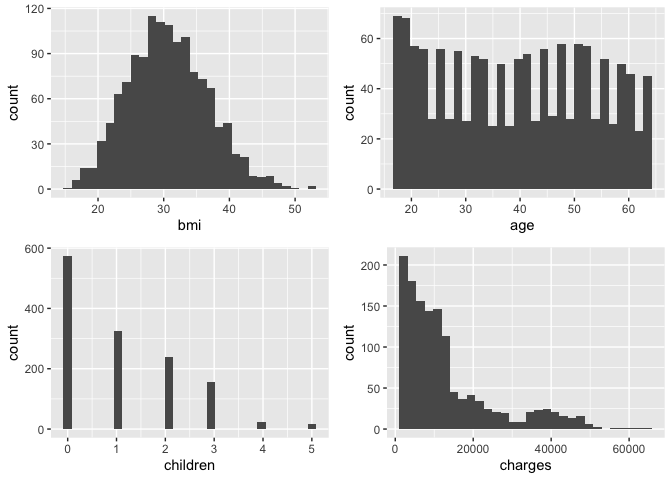<!-- -->

## График плотности


```r
charges_mean <- round(mean(ins$charges))
charges_median <- round(median(ins$charges))

density_plot <- 
  ins %>% 
  ggplot() +
  geom_density(aes(x = charges)) +
  geom_vline(aes(xintercept = charges_mean),
             color='red') +
  geom_vline(aes(xintercept = charges_median),
             color='green') +
  annotate("text", 
           x= charges_mean+4000,
           y= 4*10^-5,
           label=paste0("Mean\n", charges_mean),
           color='red',
           size=3) +
  annotate("text", 
           x= charges_median-4000,
           y= 4*10^-5,
           label=paste0("Median\n", charges_median),
           color='green',
           size=3) +
  labs(y = 'Плотность', x = 'Расходы')+
  theme_bw()
print(density_plot)
```

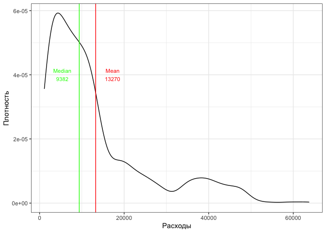<!-- -->

## Box_plot


```r
box1 <- 
  ins %>% 
  ggplot() +
  geom_boxplot(aes(x = smoker, y = charges)) +
  labs(x = 'Статус курения', y = 'Расходы') +
  theme_bw()

box2 <- 
  ins %>% 
  ggplot() +
  geom_boxplot(aes(x = sex, y = charges)) +
  labs(x = 'Пол', y = 'Расходы') +
  theme_bw()

box3 <- 
  ins %>% 
  ggplot() +
  geom_boxplot(aes(x = region, y = charges)) +
  labs(x = 'Регион', y = 'Расходы') +
  theme_bw()

combine_box_plot <- ggarrange(box1, box2, box3,
                          ncol = 3, nrow = 1)
print(combine_box_plot)
```

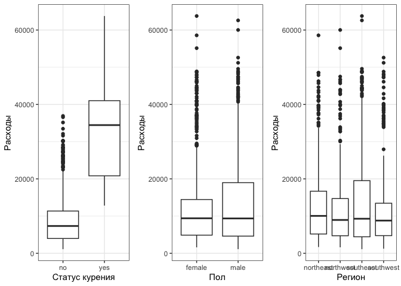<!-- -->

## Общий график


```r
combine <- 
  ggarrange(density_plot, combine_box_plot,
                          ncol = 1, nrow = 2)
combine <- 
  annotate_figure(combine, top = text_grob("Связь страховых расходов с категориальными переменными", 
               color = "black", face = "bold", size = 14))
print(combine)
```

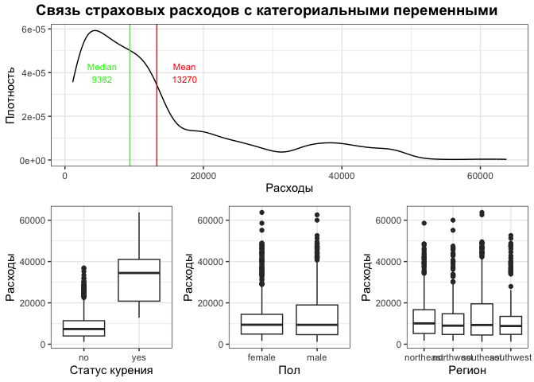<!-- -->

## Фасет


```r
density_plot+
  facet_wrap(~region)
```

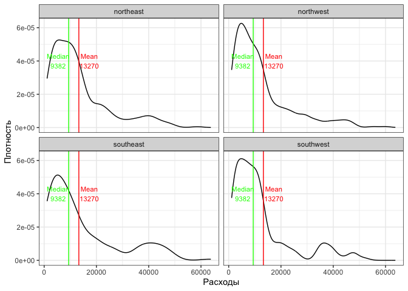<!-- -->

## Scatter plot для возраста


```r
sc_pl <- 
  ins %>%
  mutate(smoker = ifelse(smoker == "no",  "Некурящие"," Курящие")) %>% 
  ggplot() + 
  geom_point(aes(x = age, y = charges)) +
  labs(title= 'Связь возраста и страховых расходов' , x = 'Возраст', y = 'Расходы')+
  theme(plot.title = element_text(hjust = 0.5),
        panel.background = element_rect(fill = 'white', color = 'black'),
        axis.text.x = element_text(size=14))
print(sc_pl)
```

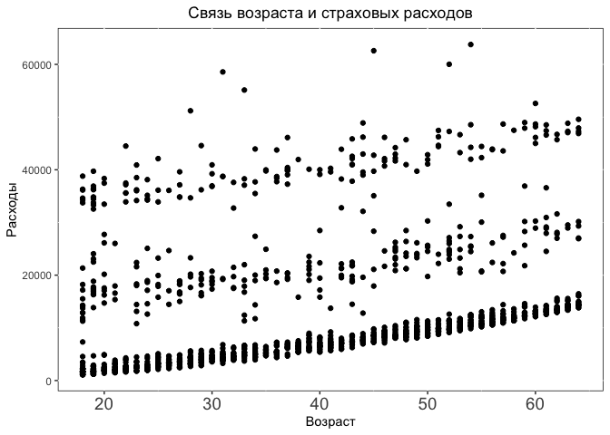<!-- -->

## Линия тренда


```r
sc_pl1 <- 
  sc_pl +
  geom_smooth(aes(x = age, y = charges),
              method=lm,
              color="red", 
              fill="blue", 
              se=TRUE)
print(sc_pl1)
```

```
## `geom_smooth()` using formula = 'y ~ x'
```

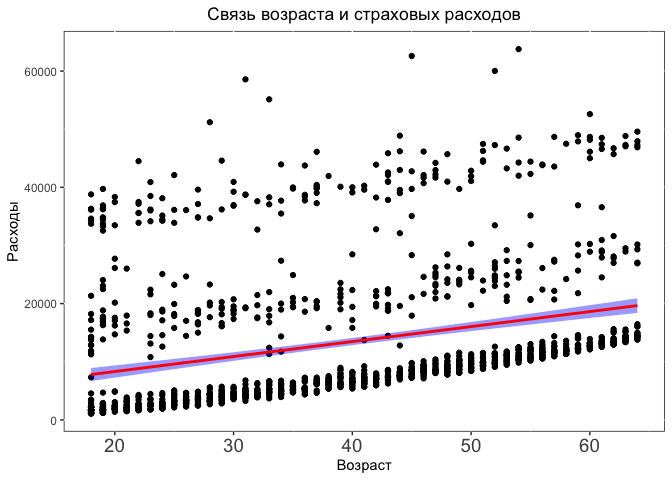<!-- -->

## Разбивка на курящих и некурящих


```r
sc_pl2 <- 
  sc_pl1+
  facet_wrap(~smoker)
print(sc_pl2)
```

```
## `geom_smooth()` using formula = 'y ~ x'
```

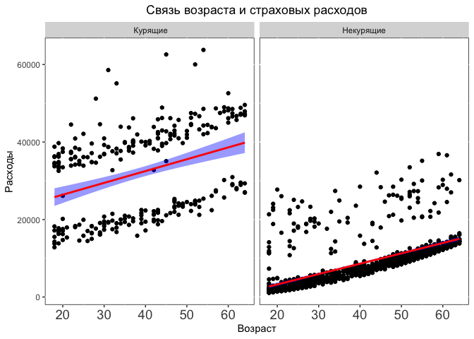<!-- -->

## Scatter plot для индекса массы тела


```r
sc_pl_bmi <- 
  ins %>% 
  mutate(smoker = ifelse(smoker == "no",  "Некурящие"," Курящие")) %>% 
  ggplot() + 
  geom_point(aes(x = bmi, y = charges)) +
  labs(title= 'Связь индекса массы тела и страховых расходов' , x = 'Индекс массы тела', y = 'Расходы')+
  theme(plot.title = element_text(hjust = 0.5),
        panel.background = element_rect(fill = 'white', color = 'black'),
        axis.text.x = element_text(size=14)) +
  geom_smooth(aes(x = bmi, y = charges),
              method=lm,
              color="red", 
              fill="blue", 
              se=TRUE) +
  facet_wrap(~smoker)
  
print(sc_pl_bmi)
```

```
## `geom_smooth()` using formula = 'y ~ x'
```

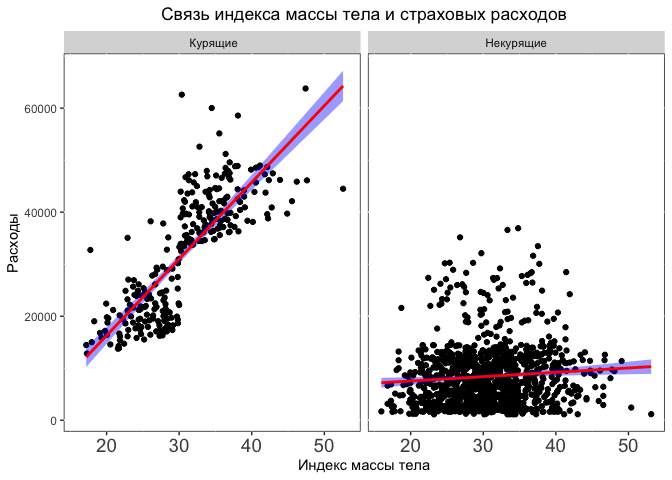<!-- -->

## Как количество детей связано с страховыми расходами и есть ли разница по полу?

Поскольку перемнная с количеством детей счетная, а не непрерывная, а также варирует в небольших пределах от 0 до 5, я решил использовать box_plot, поскольку на мой взгляд в данном случае он более информативен и сразу дает информацию об описательных статистиках в рамках заданных мной групп. Исходи из информации, полученной из графика можно сделать предварительное заключение, что количество детей практически не влияет на страховые расходы независимо от пола.


```r
box_pl_ch <- 
  ins %>%
  mutate(children_group = case_when(children < 1 ~ "0",
                          between(children, 1, 3) ~ "1 - 3",
                          children >= 4  ~ "4+") %>%
           as.factor()) %>% 
  ggplot() + 
  geom_boxplot(aes(x = children_group, y = charges)) +
  labs(title= 'Связь количества детей и страховых расходов' , x = 'Количество детей', y = 'Расходы')+
  theme(plot.title = element_text(hjust = 0.5),
        panel.background = element_rect(fill = 'white', color = 'black'),
        axis.text.x = element_text(size=14)) +
  geom_smooth(aes(x = children, y = charges),
              method=lm,
              color="red", 
              fill="blue", 
              se=TRUE) +
  facet_wrap(~sex)
  
print(box_pl_ch)
```

```
## `geom_smooth()` using formula = 'y ~ x'
```

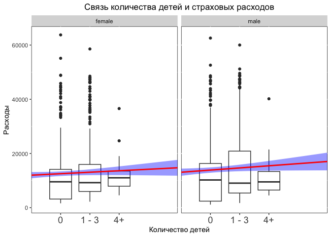<!-- -->


## Отношение индекса массы тела к логарифму трат по возрастным группам


```r
sc_pl_bmi_age <- 
  ins %>% 
  mutate(smoker = ifelse(smoker == "no",  "Некурящие"," Курящие")) %>% 
  mutate(age_group = case_when(age < 35 ~ "21-34",
                          between(age, 35, 49) ~ "35 - 49",
                          age > 49 ~ "50+") %>%
           as.factor()) %>% 
  ggplot() + 
  geom_point(aes(x = bmi, y = log(charges)),
             color = 'darkorchid4',
             alpha = 0.5) +
  labs(title= 'Отношение индекса массы тела к логарифму трат по возрастным группам')+
  theme(plot.title = element_text(hjust = 0.5),
        panel.background = element_rect(fill = 'white', color = 'white'),
        panel.grid = element_line(color = "grey",
                                  size = 0.2),
        legend.position ='bottom') +
  geom_smooth(aes(x = bmi, y = log(charges), color= age_group),
              method=lm,
              se=TRUE) +
  facet_wrap(~age_group)
```

```
## Warning: The `size` argument of `element_line()` is deprecated as of ggplot2 3.4.0.
## ℹ Please use the `linewidth` argument instead.
## This warning is displayed once every 8 hours.
## Call `lifecycle::last_lifecycle_warnings()` to see where this warning was
## generated.
```

```r
print(sc_pl_bmi_age)
```

```
## `geom_smooth()` using formula = 'y ~ x'
```

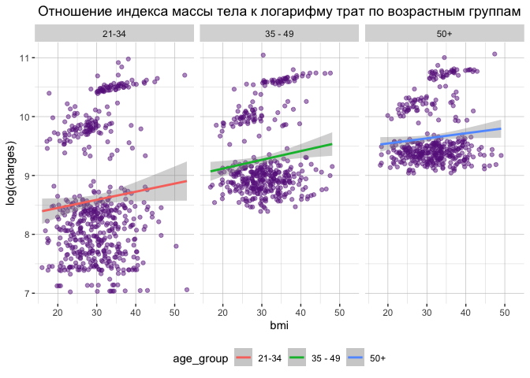<!-- -->

